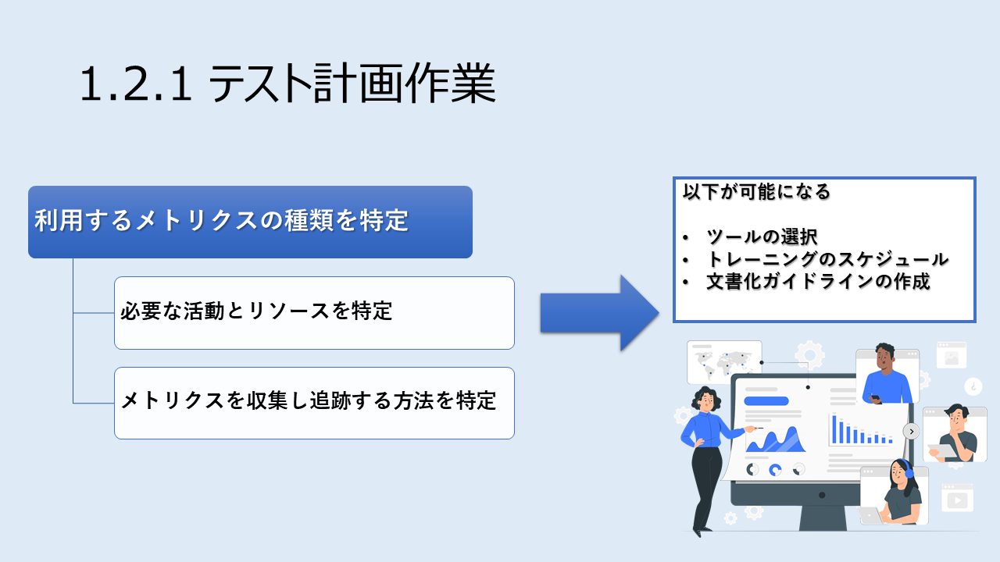

# JSTQB Advanced Level Test Manager 学習要項
## 方針
JSTQBシラバス日本語版をもとに学習を進める。テスト技法の詳細はシラバス上では記載が省略されており、参考図書を参照とされている。そのため、当ディレクトリ内で対象のテスト技法をまとめることで学習の資料を作成、学習を進める方針とする。

&nbsp;

## 学習資料参照先
### シラバス
当記事は以下に掲載されているシラバスおよび配点表を底本とし、関連する情報を取りまとめ作成している。

- ISTQBテスト技術者資格制度 Advanced Level シラバス 日本語版 テストマネージャ Version2012.J04
    - [http://jstqb.jp/syllabus.html#syllabus_advanced_altm](http://jstqb.jp/syllabus.html#syllabus_advanced_altm)
    - 配布元：JSTQBホームページ [シラバス掲載ページ](http://jstqb.jp/syllabus.html)
- ISTQB Exam Structure Tables (英語：ISTQB配点表)
    - 配布元：ISTQBホームページ [Acceptance Testingページ](https://www.istqb.org/certification-path-root/acceptance-testing.html)
    - ページ下側「Exam Documents:」欄、PDFファイル「ISTQB Exam Structure Tables」に出題内容と配点を記載している。

&nbsp;
  
### その他参考資料
シラバスに関連する資料その他情報源として以下がある。

- 新シラバス対応 JSTQB Advanced Level(テストマネージャ)資格試験説明会
    - [https://youtu.be/f36Wg6IMFBA](https://youtu.be/f36Wg6IMFBA)
- ISTQBテスト技術者資格制度 Advanced Level シラバス 日本語版 概要 テストアナリスト テクニカルテストアナリスト Version 2019.J02
    - [http://jstqb.jp/syllabus.html#syllabus_advanced_altta](http://jstqb.jp/syllabus.html#syllabus_advanced_altta)
- ISTQBテスト技術者資格制度 Advanced Level シラバス 日本語版 テストアナリスト Version3.1. 0 リリースノート
    - [http://jstqb.jp/syllabus.html#syllabus_advanced_altta](http://jstqb.jp/syllabus.html#syllabus_advanced_altta)

&nbsp;
  
## JSTQB ALTMのシラバス構成を整理
### 章立て
章立ては以下の全8章となる。

1. テストプロセス
1. テストマネジメント
1. レビュー
1. 欠陥マネジメント
1. テストプロセスの改善
1. テストツ―ルおよび自動化
1. スタッフのスキル - チーム構成
1. 参考文献

&nbsp;
  
### 出題レベルでの章立て
以下は各章から出題されそうな箇所をリストアップした。試験対策においては、このレベルで分類し内容を把握する必要があると思われる。  
※ なじみの無い用語が出てくるため **今どこを学習しているか** を把握しつつ進めるのが良いと思う

1. テストプロセス
    1. テストの計画作業、モニタリング、およびコントロール
        1. テスト計画作業
        1. テストのモニタリングとコントロール
    1. テスト分析
    1. テスト設計
    1. テスト実装
    1. テスト実行
    1. 終了基準の評価とレポート
    1. テストの終了作業
1. テストマネジメント
    1. 状況に応じたテストマネジメント
        1. テストステークホルダについて
        1. その他のソフトウェア開発ライフサイクル活動と成果物
        1. テスト活動とその他のライフサイクル活動の連携
        1. 非機能テストのマネジメント
        1. 経験ベースのテストのマネジメント
    1. リスクベーステストとその他のテストの優先度付けと工数配分のアプローチ
        1. リスクベースドテスト
        1. リスクベースドテストの技法
        1. テストを選択するためのその他の技法
        1. テストプロセスにおけるテストの優先度付けと工数の割り当て
    1. テストドキュメントとその他の成果物
        1. テストポリシー
        1. テスト戦略
        1. マスターテスト計画
        1. レベルテスト計画
        1. プロジェクトリスクマネジメント
        1. その他のテスト成果物
    1. テストの見積り
    1. テストメトリクスの定義および使用
    1. テストのビジネスバリュー
    1. 分散テスト、アウトソーステスト、およびインソーステスト
    1. 業界標準用のマネジメント
1. レビュー
    1. マネジメントレビューと監査
    1. レビューのマネジメント
    1. レビューのためのメトリクス
    1. 公式レビューのマネジメント
1. 欠陥マネジメント
    1. 欠陥ライフサイクルとソフトウェア開発ライフサイクル
        1. 欠陥ワークフローと状態
        1. 無効および重複した欠陥レポートのマネジメント
        1. クロスファンクショナルな欠陥マネジメント
    1. 欠陥レポート情報
    1. 欠陥レポート情報によるプロセス能力の評価
1. テストプロセスの改善
    1. テスト改善プロセス
        1. プロセス改善の紹介
        1. プロセス改善のタイプ
    1. テストプロセスの改善
    1. TMMIによるテストプロセスの改善
    1. TPI Nextによるテストプロセスの改善
    1. CTPによるテストプロセスの改善
    1. STEPによるテストプロセスの改善
1. テストツ―ルおよび自動化
    1. ツール選択
        1. オープンソースツール
        1. カスタムツール
        1. 投資効果(ROI)
        1. 選択プロセス
    1. ツールのライフサイクル
    1. ツールのメトリクス
1. スタッフのスキル - チーム構成
    1. 個人のスキル
    1. テストチームの力学
    1. 組織内におけるテストの適合
    1. モチベーション
    1. コミュニケーション
1. 参考文献
  
&nbsp;

## 配点の整理 <作成中>
### 配点表
JSTQB Advanced Level Test Managerの出題および配点は、ISTQB Exam Structure Tablesに以下の通り記載されている。

&nbsp;

#### 学習の目的別
学習の目的別に分けた配点と出題数は以下の通り。
  
- K1：記憶
- K2：理解
- K3：適用
- K4：分析
  
  
| 学習の目的 | 出題数 | 回答所要時間 | 回答所要時間合計 |
 ----|----|---- |---- 
| K1 | 0問 | 1分間 | 0分間 |
| K2 | 32問 | 1分間 | 32分間 |
| K3 | 15問 | 3分間 | 45分間 |
| K4 | 16問 | 4分間 | 64分間 |

&nbsp;

#### シラバス記載の章別
2022年度のAL TA試験から、2022年度AL TM試験の配点は理解の目的ごとに以下に設定されていると推測する。  
上記の配点(予測)は、これをもとに計算することとした。
  
- K1:TAに出題がないため予測不可
- K2：1点
- K3：2点
- K4：3点

&nbsp;

シラバスに記載の章別に分けた配点と出題数は以下の通り。
  

| 章番号 | 学習の目的 | 出題数 | 配点(シラバス) | 配点(予測) |
 ----|----|----|----|---- 
| TM-1.2.1 | K4 | 2問 | 記載なし | 6点 |
| TM-1.3.1 | K3 | 2問 | 記載なし | 4点 |
| TM-1.3.2 | K2 | 2問 | 記載なし | 2点 |
| TM-1.4.1 | K3 | 2問 | 記載なし | 4点 |
| TM-1.5.1 | K3 | 2問 | 記載なし | 4点 |
| TM-1.6.1 | K3 | 2問 | 記載なし | 4点 |
| TM-1.7.1 | K2 | 2問 | 記載なし | 2点 |
| TM-1.8.1 | K2 | 出題なし | 記載なし | 配点なし |
| TM-1.8.2 | K3 | 2問 | 記載なし | 4点 |
| TM-2.2.1 | K4 | 2問 | 記載なし | 6点 |
| TM-2.2.2 | K2 | 2問 | 記載なし | 2点 |
| TM-2.2.3 | K2 | 1問 | 記載なし | 1点 |
| TM-2.3.1 | K2 | 1問 | 記載なし | 1点 |
| TM-2.3.2 | K2 | 1問 | 記載なし | 1点 |
| TM-2.3.3 | K4 | 2問 | 記載なし | 6点 |
| TM-2.3.4 | K2 | 2問 | 記載なし | 1点 |
| TM-2.3.5 | K2 | 出題なし | 記載なし | 配点なし |
| TM 2.4.1 | K4 | 1問 | 記載なし | 3点 |
| TM-2.4.2 | K4 | 1問 | 記載なし | 3点 |
| TM-2.4.3 | K2 | 2問 | 記載なし | 2点 |
| TM-2.4.4 | K3 | 1問 | 記載なし | 2点 |
| TM-2.5.1 | K3 | 1問 | 記載なし | 2点 |
| TM-2.5.2 | K2 | 1問 | 記載なし | 1点 |
| TM-2.6.1 | K2 | 1問 | 記載なし | 1点 |
| TM-2.6.2 | K2 | 1問 | 記載なし | 1点 |
| TM-2.6.3 | K4 | 2問 | 記載なし | 6点 |
| TM-2.7.1 | K2 | 出題なし | 記載なし | 配点なし |
| TM-2.7.2 | K3 | 1問 | 記載なし | 2点 |
| TM-2.8.1 | K2 | 1問 | 記載なし | 1点 |
| TM-2.9.1 | K2 | 出題なし | 記載なし | 配点なし |
| TM-3.2.1 | K2 | 1問 | 記載なし | 1点 |
| TM-3.3.1 | K4 | 2問 | 記載なし | 6点 |
| TM-3.3.2 | K2 | 1問 | 記載なし | 1点 |
| TM-3.4.1 | K3 | 1問 | 記載なし | 2点 |
| TM-3.5.1 | K2 | 1問 | 記載なし | 1点 |
| TM-4.2.1 | K3 | 1問 | 記載なし | 2点 |
| TM-4.2.2 | K2 | 1問 | 記載なし | 1点 |
| TM-4.3.1 | K3 | 1問 | 記載なし | 2点 |
| TM-4.4.1 | K2 | 1問 | 記載なし | 1点 |
| TM-5.2.1 | K2 | 1問 | 記載なし | 1点 |
| TM-5.3.1 | K3 | 出題なし | 記載なし | 配点なし |
| TM-5.4.1 | K2 | 出題なし | 記載なし | 配点なし |
| TM-5.5.1 | K2 | 出題なし | 記載なし | 配点なし |
| TM-5.6.1 | K2 | 出題なし | 記載なし | 配点なし |
| TM-5.7.1 | K2 | 出題なし | 記載なし | 配点なし |
| TM-6.2.1 | K2 | 1問 | 記載なし | 1点 |
| TM-6.2.2 | K2 | 1問 | 記載なし | 1点 |
| TM-6.2.3 | K4 | 1問 | 記載なし | 3点 |
| TM-6.3.1 | K2 | 1問 | 記載なし | 1点 |
| TM-6.4.1 | K2 | 出題なし | 記載なし | 配点なし |
| TM-7.2.1 | K4 | 2問 | 記載なし | 6点 |
| TM-7.2.2 | K4 | 1問 | 記載なし | 3点 |
| TM-7.3.1 | K2 | 1問 | 記載なし | 1点 |
| TM-7.4.1 | K2 | 出題なし | 記載なし | 配点なし |
| TM-7.5.1 | K2 | 2問 | 記載なし | 2点 |
| TM-7.6.1 | K2 | 出題なし | 記載なし | 配点なし |
  
&nbsp;

以上をもとに章ごとの配点を計算すると以下の通りとなる。

&nbsp;

| 章番号 | 章タイトル | 問題数 | 配点(予想) | 
 ----| ---- | ---- | ----
| 第1章 | テストプロセス | 16問 | 30点 |
| 第2章 | テストマネジメント | 24問 | 42点 |
| 第3章 | レビュー | 6問 | 11点 |
| 第4章 | 欠陥マネジメント | 4問 | 4点 |
| 第5章 | テストプロセスの改善 | 1問 | 1点 |
| 第6章 | テストツ―ルおよび自動化 | 4問 | 6点 |
| 第7章 | スタッフのスキル - チーム構成 | 6問 | 18点 |
| **合計** |  | **66問** | **112点** |

&nbsp;

### 配点表からやらなくてよい項目を選定
やらなくて良い項目を章番号で選定した。以下は配点が極端に少なく、全問不正解であったとしても、その他の章で挽回することが十分可能である。  
  
・計算式：112点(満点) - 22点(3章～6章配点) = 90点 (得点 73点以上で合格)
  
- 3章：レビュー
- 4章：欠陥マネジメント
- 5章：テストプロセスの改善
- 6章：テストツ―ルおよび自動化

&nbsp;

## 各章の概要をとりまとめ  <取り合えず出そうなとこを書き出す>
### 0.受験にあたっての前提条件 (シラバスP9)
- 出題：多肢選択式である
- 問題数：65問、総得点の65%を正解すると合格となる
    - 合格点：73点 (上記より算出)
- 受験資格：JSTQB Foundation Level合格者であること
- 試験時間：180分間 (JSTQB HPより)

&nbsp;
  
### 1. テストプロセス (P8)
#### 1.2.テストの計画作業、モニタリング、およびコントロール

```txt
TM-1.2.1(K4) 配点：3点(予想)
システムのテストニーズを分析して、テスト目的を達成するテスト活動およびテスト成果物を計画する。
```

##### 1. 2.1 テストの計画作業

テストの計画作業では、ツールの選択、トレーニングのスケジュール、文書化ガイドラインの作成を可能にするため、以下により利用するメトリクスの種類を特定する。

- テスト戦略で特定された使命や目的を達成するのに必要な活動とリソースを特定する
- プロジェクトのガイド、計画順守の判断、および目的お達成の評価に使用されるメトリクスを収集し追跡する方法を特定する。
  
図解すると以下の通りとなる。

<p align="center">

</p>

&nbsp;
    
また、テスト設計段階では、テストマネージャが以下を決定する。

- 採用するテストレベル
- 各レベルの目標と目的
- テストに対するアプローチ(各テストレベルで使用するテスト技法等)

&nbsp;

##### 1.2.2 テストのモニタリングとコントロール

テストマネージャが効率的にテストをコントロールするため、以下を行う。

- テストスケジュールとモニタリングフレームワークを確立する
    - テスト成果物とテストリソースを計画と比較して追跡できるようにする
    - テスト成果物とテスト活動のステータスを計画と戦略目的に関連付けるために必要な、詳細な測定と対象を
含める

&nbsp;

#### 1.3.テスト分析

```txt
TM-1.3.1(K3：適用) 配点：2点(予想)
トレーサビリティを確保し、テスト目的、テスト戦略、およびテスト計画に基づいて定義されたテスト条件の完全性と一貫性をチェックする。
```

テスト分析では、「何を」テストするかをテスト条件の形式で定義する。
テスト条件の特性を以下にまとめた。

- テストベース、テスト目的、およびプロダクトリスクを分析することにより、識別可能である。
- 成功のための詳細な測定および対象（たとえば終了基準の一部）と見なすことも可能である。
- 成功のためのテスト目的、および他のプロジェクトまたはステークホルダの基準を含む。
- テストベースおよび定義された戦略目的にまで遡ることができる必要がある。
- テスト設計およびそれ以外のテスト成果物を作成した際には、これらの成果物を追跡できる必要もある。

```txt
TM-1.3.2(K2：理解) 配点：1点(予想)
テスト条件を指定する詳細度に影響を与える可能性がある要因および、詳細にテスト条件を指定することの長所と短所について説明する。
```

テスト条件を指定するための詳細度合いを決定する要因は以下の通り。

- テストレベル
- テストベースの詳細度と品質
- システムまたはソフトウェアの複雑性
- プロジェクトリスクとプロダクトリスク
- テストベース、テスト内容、およびテスト方法間の関係
- 使用するソフトウェア開発ライフサイクル
- 使用するテストマネジメントツール
- テスト設計およびその他のテスト成果物に関する、詳細度、および文書化のレベル
- テストアナリストのスキルと知識
- テストプロセスおよび組織自体の成熟度（成熟度が高いほど、高い詳細度合いが必要となることもあれば、低い詳細度合いがが可能になることもあることに注意）可必要になることもあることに注意）
- コンサルテーションのために他のプロジェクトステークホルダを利用できる可能性

詳細にテスト条件を指定する場合の利点は、以下の通りである。

- 他のテスト成果物（たとえばテストケースなど）を、より柔軟にテストベースおよびテスト目的に関連付けできる。これにより、テストマネージャはより適切で詳細なモニタリングおよびコントロールが可能となる。
- Foundation Level で説明したように、テストベースが確立されてすぐに、さらに可能であればシステムアーキテクチャと詳細設計が使用可能となる前に、より上位のテストレベルのためにプロジェクトの早期に実行することで、欠陥の防止に貢献する。
- テスト成果物を、ステークホルダが理解できる用語で説明できる（多くの場合、テストケースおよびそれ以外のテスト成果物は、ビジネスステークホルダにとって何も意味せず、実行されたテストケースの数などの単純なメトリクスは、ステークホルダのカバレッジ要件に対して無意味である）。
- 他のテスト活動だけではなく、他の開発活動にも影響を与え、活動を導くのに役立つ。
- テストの設計、実装、および実行において、詳細な測定と対象をより効率よく網羅し、より最適化した成果物を生成する。
- あるテストレベルにおける、より明確な水平トレーサビリティのためのベースを提供する。

詳細にテスト条件を指定する場合の短所には、次のようなものがある。

- 時間がかかる場合がある。
- 環境が変わった場合、保守性を維持するのが困難になる場合がある。
- チーム全体で、形式化のレベルを定義し実装する必要がある。

次の状況では、詳細なテスト条件の仕様が、特に効果的な可能性がある。

- 開発ライフサイクル、コストや時間の制約、またはその他の要因に対応するために、チェックリストなどの簡易なテスト設計文書化方式を使用している。
- 公式な要件、またはそれ以外の開発成果物が、テストベースとして、ほとんど、あるいはまったく使用できない。
- プロジェクトが大規模、複雑、または高リスクであり、単純にテストケースを開発成果物に関連付けることでは提供できないモニタリングおよびコントロールのレベモニタリングおよびコントロールを必要としている。

&nbsp;

#### 1.4.テスト設計

```txt
TM-1.4.1(K3：適用) 配点：2点(予想)
トレーサビリティを使用し、定義されたテスト条件に基づいて設計されたテストケースの完全性と一貫性をチェックする。
```

テスト設計では、テスト戦略およびテスト計画で識別したテスト技法を使用して、識別したテスト条件またはテストベースを段階的かつ詳細に作成することによりテストケースの識別を行う。

&nbsp;

#### 1.5.テスト実装

```txt
TM-1.5.1(K3：適用) 配点：2点(予想)
リスク、優先度付け、テスト環境とデータ依存性、および制約を使用して、テスト目的、テスト戦略、およびテスト計画に対して完全性と一貫性のあるテスト実行スケジュールを作成する。
```

テスト実装フェーズでの作業は以下の通り。

- テストアナリスト
    - テスト設計に基づき、テストを体系立てて優先度付けする。
- テストマネージャ
    - テスト設計に基づき、具体的なテストケース、テスト手順、テストデータを実装する。
    - テスト実行の開始基準を満たしていることを確認する。
    - テスト実行の順番、特定の環境でテストを実行するリスクや優先度の制約をチェックする。

早期のテスト実装について、長所と短所は以下の通り。

- 早期のテスト実装における短所
    - アジャイル開発/適切に管理されていないシーケンシャル開発では、イテレーション間でコードが大きく変化するため、スクリプト化しテストが信頼できなくなる。
    - テスト実装前に、ソフトウェア開発ライフサイクルとテスト可能な状況であるかの確認が推奨される。
- 早期のテスト実装における長所
    - テストベースをもとにビジネスルールを検証することができる。
    - ソフトウェア仕様の弱点を識別できる可能性がある。
    - 動作の期待結果をソフトウェア設計者、開発者に提供できる。

&nbsp;

#### 1.6.テスト実行

```txt
TM-1.6.1(K3：適用) 配点：2点(予想)
トレーサビリティを使用し、テスト目的、テスト戦略、およびテスト計画との完全性と一貫性という観点で、テスト進捗をモニタリングする。
```

テスト実行におけるテストマネージャの役割は以下の通り。

- テスト計画に従って進捗をモニタリングする。
- 必要に応じて、使命、目的、戦略という点でテストを成功に導くため、コントロール活動を開始し実行する。
    - テスト結果からテスト条件、テストベース、テスト目的へとさかのぼるトレーサビリティを使用できる。
    - テスト目的からテスト結果へと進みトレーサビリティを使用できる。

&nbsp;

#### 1.7.終了基準の評価とレポート

```txt
TM-1.7.1(K2：理解) 配点：1点(予想)
終了基準に対する正確なレポート作成と評価を支援するために、テストプロセスにおける正確でタイムリーな情報収集が重要であることを説明する。
```

テストマネージャは、テスト分析、テスト設計、テスト実装、およびテスト実行中に効率的な評価およびレポートを促進するため、これらの活動を担当するテストチームのメンバーが必要な情報を正確かつタイムリーに提供できるようにする必要がある。  
  
発生する作業は以下の通り。

- レポートの頻度と詳細度についてテスト計画フェーズで検討する。
- レポートの頻度と詳細度について関連するプロジェクトステークホルダーと協議する。

・注：タイトルには「終了基準の評価とレポート」とあるが、終了基準について記述がない

&nbsp;

#### 1.8.テストの終了作業
  
```txt
TM-1.8.1(K2：理解) 配点：1点(予測)
テスト終了作業における4つのグループの作業を要約する。
```

以下にテスト終了作業におけるグループの作業を要約した。シラバスに記載されている補足的な説明は省いている。

1. テスト完了チェック
    - すべてのテスト作業が実際に完結したことを確認する。
1. テスト成果物の提供
    - 価値ある成果物を、それを必要とする人々へ届ける。
1. 学習した教訓
    - 振り返りミーティングを主催するか、振り返りミーティングに参加する。
    - 重要な教訓をドキュメントにまとめる。
    - 優れた点を繰り返し、また過ちを繰り返さないようにする。
    - プロジェクト計画で対応すべき解決できない問題を明らかにして計画を立てられるようにする。
1. 構成管理システムへ、結果、ログ、レポート、その他ドキュメント、および成果物を保管する。

```txt
TM-1.8.2(K3：適用) 配点：2点(予測)
プロジェクトの振り返りを実行し、プロセスを評価し、改善する領域を発見する。
```
上記の「3.学習した教訓」でプロセス改善の余地を検討する。

&nbsp;

### 2.テストマネジメント (P18)
#### 2.2.状況に応じたテストマネジメント
##### 2.2.1.テストステークホルダについて
```txt
TM-2.2.1 (K4：分析) 配点：3点(予測)
ステークホルダ、状況、およびソフトウェア開発ライフサイクルを含むソフトウェアプロジェクトまたはプログラムのニーズを分析し、最適なテスト活動を識別する。
```

テストマネージャは、プロジェクトまたはプログラムに関係するステークホルダを識別する。また、テストと相互に影響するソフトウェア開発ライフサイクル活動と成果物を識別子、テストプロセスの有効性と効率性を最適化する。  
ステークホルダの可能性がある者は以下の通り。

- 開発者、開発リーダ、開発マネージャ
    - テストマネージャよりテスト結果を受け取る。
    - テスト結果をもとに欠陥の修正等の対応を行う。
- データベースアーキテクト、システムアーキテクト、設計者
    - テストマネージャよりテスト結果を受け取る。
    - テスト結果をもとに対応を行う。
- マーケティングアナリスト、ビジネスアナリスト
    - ソフトウェアに搭載する機能、および機能の品質レベルを決定する。
    - テストカバレッジの定義、テスト結果のレビュー、テスト結果に基づく意思決定に関与する。
- 上級管理職、プロダクトマネージャ、プロジェクトスポンサ
    - テストカバレッジの定義、テスト結果のレビュー、テスト結果に基づく意思決定に関与する。
- プロジェクトマネージャ
    - テスト活動に必要なリソースを確保する。
    - テストマネージャと協力してテストの計画とコントロールを行う。
- テクニカルサポート、顧客サポート、およびヘルプデスク
    - ソフトウェアの機能と品質に影響を受けるユーザと顧客をサポートする。
- 直接的/間接的ユーザ
    - ソフトウェアを使用する。もしくはソフトウェアから出力されたデータを使用する。

上記の通り、TM-2.2.1にはステークホルダについてのみ記載されている。タイトル自体が「テストステークホルダについて」となっている。「学習の目的」にはそれ以外についても記載されているが、出題はステークホルダについてのみと推測される。


```txt
TM-2.2.2 (K2：理解) 配点：1点(予測)
ソフトウェア開発ライフサイクル活動と、成果物がテストに与える影響、およびテストがソフトウェア開発ライフサイクル活動と成果物に与える影響を理解する。
```

ソフトウェア開発ライフサイクル活動とテストの関連は以下の通り。(注：どちらかというと「テストマネージャとの関連」が書かれているように見えます)
  
- 要求エンジニアリングおよび要求管理
    - テストマネージャは、要件の変更を認識し、この変更に対応してテストコントロール活動を実行する。
    - テクニカルテストアナリストは、要件のレビューに参加する必要がある。
    - テクニカルアナリストは、要件のレビューに参加する必要がある。
- プロジェクトマネジメント
    - テストマネージャは、テストアナリストおよびテクニカルアナリストと協力し、スケジュール要件とリソース要件をプロジェクトマネージャに伝える。
    - テストマネージャは、プロジェクトマネージャと協力し、プロジェクト計画の変更を理解し、テストコントロールアクションを実行して、これらの変更に対応する必要がある。
- 構成管理、リリース管理、変更管理
    - テストマネージャは、テストチームと協力して、テスト対象を配布するプロセスを確立し、テスト計画の中にそれらを取り込む必要がある。
    - テストマネージャは、テストアナリストおよびテクニカルアナリストに対して、ビルド検証テストを作成し、テスト実行中のバージョン管理を確実に行うように指示することが可能である。
- ソフトウェア開発と保守
    - テストマネージャは、開発マネージャと協力して、欠陥マネジメントに参加する。
    - テストマネージャは、開発マネージャと協力して、各テストリリースの内容と日程など、テスト対象の配布を調整する必要がある。
- テクニカルサポート
    - テストマネージャは、テクニカルサポートマネージャと協力して、テスト終了作業時にテスト結果を適切に提供する必要がある。
    - テストマネージャは、テクニカルサポートマネージャと協力して、テストプロセスを改善するために、運用時の故障を分析する必要がある。
- 技術ドキュメントの作成
    - テストマネージャは、技術ドキュメントマネージャと協力し、テストを行うためのドキュメントをタイムリーに提供する。
    - テストマネージャは、技術ドキュメントマネージャと協力し、ドキュメントに記載された欠陥をマネジメントする。

```txt
TM-2.2.3 (K2：理解) 配点：1点(予測)
経験ベースのテストおよび非機能テストに関するテストマネジメントの問題を管理する方法を説明する。
```

非機能テストにおいて、テストマネージャが考慮する事項は以下の通り。

- 次の一般的な事項について考慮するようテクニカルテストアナリストに指示する
    - ステークホルダの要因
    - 必要なツールの使用
    - テスト環境
    - 組織的要因
    - セキュリティ

- 非機能テストをソフトウェア開発ライフサイクルに統合するため以下を考慮する。
    - 全ての機能テストが完了してから非機能テストを開始するのは一般的に誤りである。
    - 非機能テストはリスクに応じて優先度付けし順番を決める必要がある。
    - 単一イテレーションのスケジュールよりテスト設計と実装の方が時間がかかる場合は、非機能テストをイテレーションから外れた独立した活動として整理する必要がある。

&nbsp;

#### 2.3.リスクベーステストとその他のテストの優先度付けと工数配分のアプローチ
```txt
TM-2.3.1 (K2：理解) 配点：1点(予測)
リスクベーステストでリスクに対応する様々な方法を説明する。
```
- テストチームは、テストを設計、実装、および実行して、品質リスクを軽減する
- テストで欠陥が明らかになった場合、欠陥の存在を周知させ、リリース前にその欠陥に対応する機会を提供したことにより、テストで品質リスクを軽減したことになる。
- テストにより欠陥が検出されなかった場合、テスト条件の下でシステムが正しく動作したことを確認することにより、テストで品質リスクを軽減したことになる。
- プロダクト品質リスクは、テスト実行前に軽減することが可能である(例；徹底的な要求使用のレビュー)。

```txt
TM-2.3.2 (K2：理解) 配点：1点(予測)
プロダクトリスク分析のための様々な技法を、例を示して説明する。
```
```txt
TM-2.3.3 (K4：分析) 配点：3点(予測)
プロダクト品質リスクを分析、識別、および評価し、主要なプロジェクトステークホルダの観点に基づいて、リスクとその評価されたリスクレベルの概要を説明する。
```
```txt
TM-2.3.4 (K2：理解) 配点：1点(予測)
識別したプロダクト品質リスクを、ライフサイクルとテストプロセス全体を通じて、評価したリスクレベルに応じて、軽減しマネジメントする方法を説明する。
```
```txt
TM-2.3.5 (K2：理解) 配点：1点(予測)
テストの選択、テストの優先度付け、および工数の割り当てに関する様々なオプションの例を示す。
```
&nbsp;

#### 2.4.テストドキュメントとその他の成果物
```txt
TM-2.4.1 (K4：分析) 配点：3点(予測)
提供されたポリシーとテスト戦略のサンプルを分析し、これらのドキュメントに対して完全性と一貫性のあるマスターテスト計画書、レベルテスト計画書、およびテスト成果物を作成する。
```
```txt
TM-2.4.2 (K4：分析) 配点：3点(予測)
所定のプロジェクトに対して、プロジェクトリスクを分析し、適切なリスクマネジメントオプション(コンティじぇんシープラン、移転、受け入れ等)を選択する。
```
```txt
TM-2.4.3 (K2：理解) 配点：1点(予測)
テスト戦略のテスト活動に対する影響を、例を示して説明する。
```
```txt
TM-2.4.4 (K3：適用) 配点：2点(予測)
適用可能な標準化団体の利用可能なテンプレートを採用して、組織、ライフサイクル、およびプロジェクトのニーズに合ったテスト成果物のための文書化の基本とテンプレートを定義する。
```

&nbsp;

#### 2.5.テストの見積り
```txt
TM-2.5.1 (K3：適用) 配点：2点(予測)
所定のプロジェクトに対して、適用可能なすべての見積り技法を使用して、全てのテストプロセス活動の見積りを作成する。
```
```txt
TM-2.5.2 (K2：理解) 配点：1点(予測)
テストの見積りに影響を与える可能性がある要因を理解し、例を示す。
```
&nbsp;

#### 2.6.テストメトリクスの定義および使用
```txt
TM-2.6.1 (K2：理解) 配点：1点(予測)
一般的なテスト関連のメトリクスを説明し比較する。
```
```txt
TM-2.6.2 (K2：理解) 配点：1点(予測)
テスト進捗モニタリングの様々な側面を比較する。
```
```txt
TM-2.6.3 (K4：分析) 配点：3点(予測)
未対応のリスク、欠陥ステータス、テスト実行ステータス、テストカバレッジステータス、および確信度合いの観点で、テスト結果を分析およびレポートし、プロジェクトステークホルダがリリースを決定するための判断材料となる的確な情報と提案を提供する。
```
&nbsp;

#### 2.7.テストのビジネスバリュー
```txt
TM-2.7.1 (K2：理解) 配点：1点(予測)
品質コストを決定する4つのカテゴリのそれぞれについて例を示す。
```
```txt
TM-2.7.2 (K3：適用) 配点：2点(予測)
品質コストをベースに、他の定量的および定性的要素を考慮して、テストの価値を見積り、見積もった価値をステークホルダに伝える。
```
&nbsp;

#### 2.8.分散テスト、アウトソーステスト、およびインソーステスト
```txt
TM-2.8.1 (K2：理解) 配点：1点(予測)
分散テスト、アウトソーステスト、およびインソーステストのチームスタッフ戦略を、適切に使用するために必要な要因を理解する。
```
&nbsp;

#### 2.9.業界標準用のマネジメント
```txt
TM-2.9.1 (K2：理解) 配点：1点(予測)
ソフトウェアテストに関する標準の出典とその要素についてまとめる。
```
&nbsp;

### 7.スタッフのスキル - チーム構成 (P72)
#### 7.2.個人のスキル
```txt
TM-7.2.1 (K4：分析) 配点：3点(予測)
スキルアセスメントスプレッドシートを使用して、ソフトウェアシステムの使用、ドメインおよびビジネスに関する知識、システム開発領域、ソフトウェアテスト、対人関係スキルに関する、チームメンバーの強みと弱みを分析する。
```
```txt
TM-7.2.2 (K4：分析) 配点：3点(予測)
チームのスキルに関するアセスメント結果を分析し、トレーニングとスキル開発計画を策定する。
```
&nbsp;

#### 7.3.テストチームの力学
```txt
TM-7.3.1 (K2：理解) 配点：1点(予測)
特定の状況でテストチームのリーダーとなるために必要なハード面とソフト面の仕切るについて説明する。
```
&nbsp;

#### 7.4.組織内におけるテストの適合
```txt
TM-7.4.1 (K2：理解) 配点：1点(予測)
独立テストのオプションを説明する。
```
&nbsp;

#### 7.5.モチベーション
```txt
TM-7.5.1 (K2：理解) 配点：1点(予測)
テスト担当者のモチベーションを上げる要因、および下げる要因について、例を挙げて説明する。
```
&nbsp;

#### 7.6.コミュニケーション
```txt
TM-7.6.1 (K2：理解) 配点：1点(予測)
テストチーム内、およびテストチームとステークホルダとの間のコミュニケーションを、効率的に行うための要因を説明する。
```
&nbsp;


### 参考ページ
以下に、JSTQB AL TM試験の参考になると思われるブログ記事や参考資料をリストアップした。  

- Togetter「試験に出ないJSTQB　FL・AL」(2016/5/27)
    - [https://togetter.com/li/980107](https://togetter.com/li/980107)
