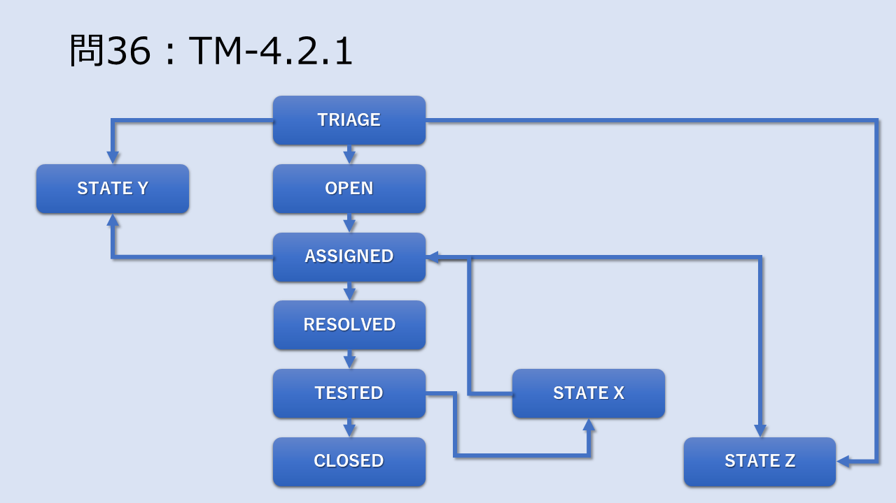

# JSTQB Advanced Level Test Manager サンプル問題(翻訳)
## 方針
ISTQBサイトに掲載されているサンプル問題を翻訳する。その後、サンプル問題を元に独自の模擬試験問題を作成する。

&nbsp;

## サンプル問題参照先
- Certified Tester Advanced Level Test Manager (CTAL-TM)
    - [https://www.istqb.org/certifications/test-manager](https://www.istqb.org/certifications/test-manager)
    - ISTQBのテストマネージャー試験紹介ページ右側リンクよりサンプル問題をダウンロード
    - DL日時：2022/4/8
    - ファイル名
        - ISTQB-CTAL-TM_Sample-Exam-A-Questions_v1.3.1.pdf
        - ISTQB-CTAL-TM_Sample-Exam-A-Answers_v1.3.1.pdf

&nbsp;

## 翻訳済みサンプル問題
### 問1：TM-1.2.1 (配点 3点)
#### 問題

あなたは、観光情報モバイルアプリケーションを開発するプロジェクトのテストマネージャーです。このプロジェクトは最近、アジャイルプロセスとテスト駆動開発に切り替わりました。各開発サイクルは15日間で、7日目から毎日ビルドを行います。
10日目以降、新しい機能を追加することはできません。開発チームは非常に経験豊富なメンバーで構成されており、彼らは自分たちの仕事に誇りを持っているが、テストチームには寛容ではあません。  
  
要件は、次のような粗い粒度のユーザーストーリーとして書き出されています。
このソフトウェアは、既存のウェブサービスに依存しており、開発中にスタブ化されている。ユニットテストは開発者が行い、システムテストとユーザー受け入れテストはテストチームが担当する。以前の開発サイクルでは、新しく開発された機能の深刻な障害のために、システムテストがしばしばブロックされていました。分析によると、これらの障害の多くはユニットテスト中に発見することができました。生産中に発見された問題の分析によると、パフォーマンス問題の30%は、サードパーティサプライヤが提供する信頼性の低いWebサービスが原因であることがわかりました。  
主なテスト目標は、認識されたパフォーマンスリスクを軽減することと、優先度=高 のユーザーストーリーで深刻度の高い障害が発生しないことを確信することです。
さらに、上層部はテスターと開発者がより緊密に協力することを要求してきました。
次のテスト活動および/または作業成果のうち、テスト目標を最もよく達成できるものはどれですか？

- a) 毎日のビルドが始まる7日目までに、テストチームが行う検査による詳細設計仕様の承認
- b) プロジェクトマネジメントとテストマネジメントが行う、外部Webサービスの特定とサービスプロバイダーとのサービスレベルアグリーメント（SLA）の施行
- c) 各開発サイクル前にテストマネージャが定義し、10日目に開発者に引き渡される統合テストのレベルプラン
- d) 単体テスト用のメトリクスを定義し、7日目にテストマネジメントに報告する。
- e) 10日目から始まるテスト実行のシステムテスト中に、テスターが優先度≧高 のユーザーストーリーの自動パフォーマンステストを行う。

2つの選択肢を選んでください。

--- 

### 問2：TM-1.3.1 (配点 2点)
#### 問題
あなたは、観光情報モバイルアプリケーションを開発するプロジェクトのテストマネージャーです。このプロジェクトは最近、アジャイルプロセスとテスト駆動開発に切り替わりました。各開発サイクルは15日間で、7日目から毎日ビルドを行います。10日目以降、新しい機能を追加することはできません。開発チームは非常に経験豊富なメンバーで構成されており、彼らは自分たちの仕事に誇りを持っているが、テストチームには寛容ではありません。要件は、次のような粗い粒度のユーザーストーリーとして書き出されています。 

    US 03-30。最寄りのホテルを検索する
    知らない土地で気軽に利用するユーザーとして、自分の経済的・快適性プロファイルに最も近いホテルの情報を得たい
    優先度：高
    見積り: 7 (10点満点)  
  
このソフトウェアは、既存のウェブサービスに依存しており、開発中にスタブ化されています。ユニットテストは開発者が行い、システムテストとユーザー受け入れテストはテストチームの責任で行います。以前の開発サイクルにおけるシステムテストは、新しく開発された機能の深刻な障害のためにしばしばブロックされました。分析によると、これらの障害の多くはユニットテスト中に発見することができました。生産中に発見された問題の分析によると、パフォーマンス問題の30%は、サードパーティサプライヤが提供する信頼性の低いWebサービスが原因でした。
主なテスト目標は、認識されたパフォーマンスリスクを軽減することと、優先度=高 のユーザーストーリーで深刻度の高い障害が発生しないことを確信することです。さらに、上層部はテスターと開発者がより緊密に協力することを要求していました。 
  
受入テストの終了基準として、以下の項目が指定された。 
  
    AC 1: 優先度が非常に高いユーザーストーリーの最大1,000の同時リクエストに対するソフトウェア応答時間 <= 3秒
    AC 2: 優先度が >= 高いユーザーストーリーの最大 10,000 件の同時リクエストに対するソフトウェア応答時間 <= 10 秒
    AC 3: 優先度が高いユーザーストーリーのシステムおよびユーザー受け入れテストに重大な障害がないこと。
    AC 4: すべてのユーザーストーリーは、少なくとも1つのユーザー受け入れテストケースでカバーされている。

テスト戦略では、優先度≧高いユーザーストーリーのシステムテストと受け入れテストに等価分割が必要です。 
  
今回の開発サイクルでは、以下のユーザーストーリーが選択され、実施されました。
(P = 優先度; E = 見積もり工数)  
  
    US 02-10: 選択したホテルのビデオを再生する (P: 中; E: 4)
    US 02-20: BGMの再生（P:低、E:2）
    US 03-20: 最寄りのホテル5軒を検索 (P: 非常に高い; E: 4)
    US 03-30: 最も近いホテルの検索 (P: 高; E: 7)  
  
システムテストのためのテスト解析が始まったところですが、以下のようなテスト条件が確認されました。 
  
    TC 02-10-1: 動画の再生、サポートされているすべての形式を使用する
    TC 03-20-1: 最寄りのホテル5軒をリストアップ、ロケーションは等価分割を使用  
    TC 03-30-1: 最寄りのホテルのリストアップ、ユーザープロファイルとロケーションの等価パーティション使用
    TC PE-xx-1: ユーザーストーリーUS 03-30の最大10,000同時リクエストに対する性能テスト
    TC PE-xx-2: ユーザーストーリーUS 03-20の同時リクエスト1,000件までの性能テスト  
  
このサイクルですべての終了条件を満たすために追加しなければならないテスト条件の最小数は何か？ 
  
- a) 2
- b) 1
- c) 3
- d) 4

選択肢を1つ選んでください。
  
---

### 問3：TM-1.3.2 (配点 1点)
#### 問題
システムテストにおいて、詳細なテスト条件を規定する必要があることを最もよく示しているのは、次のうちどれか。

- a) テスト設計とテスト実行を外部に委託している。
- b) テストベースが頻繁に変更される
- c) テスト設計時にドメインの専門家が相談にのってくれる。
- d) テストベースが低品質である
- e) テスト条件は、管理のマイルストーンプレゼンテーションに使用される。

選択肢を2つ選んでください。

---

### 問4：TM-1.4.1 (配点 2点)
#### 問題
あなたが野心的な新興企業に勤めていると仮定します。彼らは、Web上で顧客に販売する中小企業向けに、カスタマイズされたロイヤルティプログラムやリワードプログラムを提供するシステムを構築しています。これらの企業は、このシステムのウェブストアに登録します。そして、そのボタンを自社のホームページに設置することで、顧客が自社のポイントプログラムに登録することができる。購入した商品にはポイントが付与され、企業も顧客もそのプログラムを管理することができます。
  
あなたの雇用主のマーケティング担当者は、このシステムを大々的に宣伝し、創業間もない企業に対して初年度料金の大幅な割引を提供しています。マーケティング資料には、このサービスが企業やその顧客にとって信頼性が高く、非常に速いスピードで提供されることが書かれています。
  
現時点では、必要なものは揃っており、ソフトウェアの開発は始まったばかりです。現在のスケジュールでは、3ヵ月後には企業とその顧客が登録を開始できる予定です。
  
雇用主は、このサービスをホストするためにクラウドコンピューティングリソースを使用し、開発者、テスト担当者、その他のエンジニアや管理者のための通常のオフィスコンピュータ以外のハードウェアリソースを持たないことを意図しています。システムの構築には、業界標準のウェブベースのアプリケーションソフトウェアコンポーネントが使用される予定です。
  
品質リスク分析プロセスで特定された次のリスク項目を検討します。
  
    ある企業のウェブサイト用にカスタマイズされた入会ボタンに、その企業のポイントプログラム用の正しいURLが割り当てられていない。
  
このリスク項目をカバーするテストケースを決定するために、トレーサビリティを使用したと仮定してください。
  
次のうち、完全で、正しく、このリスク項目をカバーする肯定的なテストはどれですか？
  
- a) 会社登録ボタンを素早くクリックして、何が起こるか確認する。
- b) ホームページのURLをクリックし、ホームページが表示されることを確認する。
- c) 会社登録ボタンをクリックし、その会社の登録ページに移動することを確認する。
- d) 会社の登録ボタンをクリックし、当社のホームページに移動することを確認する。

選択肢を1つ選んでください。

--- 

### 問5：TM-1.5.1 (配点 2点)
#### 問題
シナリオ1  
あなたは野心的な新興企業に勤めていると仮定します。彼らは、Web上で顧客に販売する中小企業向けに、カスタマイズされたロイヤルティプログラムやリワードプログラムを提供するシステムを構築しています。これらの企業は、システムのウェブストアに登録します。そして、そのボタンを自社のホームページに設置することで、顧客が自社のポイントプログラムに登録することができる。購入した商品にはポイントが付与され、企業も顧客もそのプログラムを管理することができます。
  
あなたの雇用主のマーケティング担当者は、このシステムを大々的に宣伝しており、新規に契約した企業には初年度費用の大幅な割引を提供しています。マーケティング資料には、このサービスが企業やその顧客にとって信頼性が高く、非常に速いスピードで提供されると書かれている。
  
現時点では、必要なものは揃っており、ソフトウェアの開発は始まったばかりです。現在のスケジュールでは、3ヵ月後には企業とその顧客が登録を開始できる予定です。
  
雇用主は、このサービスをホストするためにクラウドコンピューティングリソースを使用し、開発者、テスター、その他のエンジニアや管理者のための通常のオフィスコンピュータ以外のハードウェアリソースを持たないことを意図しています。システムの構築には、業界標準のウェブベースのアプリケーションソフトウェアコンポーネントが使用されます。
  
あなたは、リスクベースのテスト戦略に従って、可能性と影響の両方を非常に低いものから非常に高いものまでの5段階で評価することにしています。品質リスク分析プロセスで特定された次のリスク項目を考えてみましょう。
  
    ある企業のWebサイトのカスタマイズされた登録ボタンに、その企業のロイヤルティプログラムの正しいURLが割り当てられていない。
  
技術的なプロジェクト関係者は、このリスクの可能性を中程度と評価しているとします。
  
上記の情報のみから考えると、次の記述のうち確実に正しいものはどれか？

- a) このリスク項目は、非常に高い影響レベルのリスクとして評価されるべきである。
- b) このリスク項目に関連するテストケースは、テスト実行期間の中で最初に実行しなければならない。
- C) このリスク項目に関連するテストケースは、テスト実行期間の中盤に実行されなければならない。
- d) このリスク項目には、影響度に基づき、多くのテストケースを関連付ける必要がある。

選択肢を1つ選んでください。

---

### 問6：TM-1.6.1 (配点 2点)
#### 問題
ある企業では、テストはリスクベースのテスト戦略に従うことが期待されている。現在、プロジェクトがテスト実行中であると仮定する。以下のテストについて、与えられた値はそれぞれ、テスト識別子、リスクレベル、テストの対象となる要求の識別子、現在のテストステータスを表している。

| テスト識別子 | リスクレベル | 要求の識別子 | ステータス | 
 ----|----|----|---- 
| 02.007 | Very high | 1分間 | Fail | 
| 02.010 | Hign | 1分間 | Ready to run | 
| 02.019 | Vary low | 3分間 | Pass | 

次の記述のうち、正しいものはどれか。

- a) テスト02.010は02.019よりリスクが高いので、テスト順序は確実に間違っている。
- b) もしテスト計画が、できるだけ早い時期に各要件に対して少なくとも1つのテストを実行することを求めているなら、テスト順序は正しいかもしれない。
- c) テストマネージャは、テストシーケンスに存在するすべての問題を評価しながら、テストの実行を停止する必要があります。
- d) テスト02.019を実行しても欠陥が見つからなかったので、時間の無駄であった。
- e) テスト 02.010 は 02.019 よりもリスクが高いので、テストチームはテスト戦略に従っていないかもしれない。
  
選択肢を2つ選んでください。

--- 

### 問7：TM-1.7.1 (配点 1点)
#### 問題
単体テスト実行時のテスト進捗報告書に記載する指標として、最も適切なものはどれか。

- a) 単体テストの欠陥検出率(DDP)
- b) 計画された欠陥と実際に報告された欠陥の比較
- c) 単体テスト時間対統合テスト時間
- d) 確認されたテスト条件の数
- e) 計画されたカバレッジと実際に達成されたカバレッジ

選択肢を2つ選んでください。

--- 

### 問8：TM-1.8.1 (配点 1点)
#### 問題
テスト終了の活動「テスト完了チェック」の概要として、正しいものはどれか。

- a) テスト完了チェックは、すべてのテスト作業が計画通りに終了していることを確認する。
- b) テスト完了チェックは、学んだ重要な教訓がすべて文書化されることを保証する。
- c) テスト完了チェックは、すべてのテスト作業成果が構成管理システムに保存されていることを確認する。
- d) テスト完了チェックは、優れた実践を確実に繰り返すことができるような計画が確立されていることを保証する。

選択肢を1つ選んでください。

--- 

### 問9：TM-1.8.2 (配点 2点)
#### 問題
シナリオ1
あなたは野心的な新興企業に勤めていると仮定します。彼らは、Web上で顧客に販売する中小企業向けに、カスタマイズされたロイヤリティとリワードプログラムを提供するシステムを作成しています。これらの企業は、システムのウェブストアに登録します。そのため、企業側は自社のWebサイトにカスタマイズしたボタンを設置し、顧客がその企業のポイントプログラムに登録することができる。購入するたびにポイントが加算され、企業と顧客の双方がプログラムを管理することができます。たとえば、無料の製品やサービスを受けるために必要なポイント数を決定することができます。
  
あなたの雇用主のマーケティング担当者は、このシステムを大々的に宣伝しており、新規に契約した企業には初年度費用の大幅な割引を提供しています。マーケティング資料には、このサービスが企業やその顧客にとって信頼性が高く、非常に速いスピードで提供されると書かれている。
現時点では、必要なものは揃っており、ソフトウェアの開発は始まったばかりです。現在のスケジュールでは、3ヵ月後に企業とその顧客が登録できる予定です。
  
このサービスのホストにはクラウドコンピューティングリソースを使用し、開発者、テスター、その他のエンジニアや管理者用の通常のオフィスコンピューター以外のハードウェアリソースは持たない予定です。システム構築には、業界標準のウェブベースのアプリケーションソフトウェアコンポーネントが使用される予定です。
  
プロジェクトは初期リリースを完了し、システムは1ヶ月前から企業やその顧客によって使用されていると仮定します。あなたのチームは、リスクベース、要件ベース、およびリアクティブテストの混合戦略を使用しました。品質リスク分析では、ボタンのカスタマイズが最もリスクの低い分野と評価され、登録が最もリスクの高い分野と評価されました。あなたは、テスト作業の回顧を実施している。
  
このレトロスペクティブで考慮すべき領域は次のうちどれですか。

- a) ボタンのカスタマイズにおいて、ユーザーから重大な問題が報告されているかどうかを評価する。
- b) 登録、カスタマイズ、およびポイント管理のテストケースに必要な詳細レベルの決定
- c) 企業またはその顧客に影響を及ぼしている登録に関する問題の特定
- d) 既知の不具合と失敗したテストをシステムサポートチームに提供する。
- e) 登録要件の網羅性を測定し、プロジェクトおよびビジネス利害関係者に報告する。

選択肢を2つ選んでください。

---

### 問10：TM-2.2.1 (配点 3点)
#### 問題
シナリオ 2:
あなたは、成熟したアプリケーションのテストを管理していると仮定してください。このアプリケーションはオンラインデートサービスで、ユーザが自分のプロフィールを入力し、自分と相性の良い人と会い、その人たちとの交流イベントを手配し、連絡を取りたくない人をブロックすることができます。

    1. 次のようなグループを考えてみましょう。
    2. デート相手を探すアプリケーションのユーザー
    3. 会社の経営者、株主
    4. 結婚相手を探すためにアプリを利用した既婚者
    5. 官公庁の職員

次のテスト活動のリストを考えてみてください。

    A. アプリケーションから提案されたマッチングの相性テスト
    B. アプリケーションがユーザーを正しく課金する能力のテスト
    C. アプリケーションが現地の税制に準拠する能力のテスト

ここで与えられた情報のみに基づいて、次の記述のうち、現在の利害関係者とそのテスト対象者の1つ以上が正しく一致するものはどれですか?

- a) 1 - A,B    2 - A,B,C   3 - B   4 - C
- b) 1 - A,B    2 - A,B,C           4 - A,C
- c) 1 - A,B,C  2 - A,B,C           4 - C
- d) 1 - A,B    2 - A,B,C           4 - C
  
選択肢を一つ選んでください。

---

### 問11：TM-2.2.2 (配点 1点)
#### 問題
次の記述のうち、プロジェクトマネジメントの作業成果物がテストに与える影響を正しく反映しているものはどれか。

- a) テストマネージャは、テスト終了時にテクニカルサポートマネージャと協力すべきである。
- b) テストマネージャは、プロジェクトマネージャと協力して、プロジェクトのスケジュールを作成すべきである。
- c) プロジェクト計画の制約により、テストが制約されることがある。
- d) テストは、要求仕様を完全に網羅する必要がある。

選択肢を1つ選んでください。

--- 

### 問12：TM-2.2.3 (配点 1点)
#### 問題
次の記述のうち、非機能テストを管理するための適切なアプローチを説明したものはどれか。

- a) 非機能リスクは、テストの初期レベルまたは開発中でさえも軽減されるべきである。
- b) 単一のイテレーションより長い時間を要する非機能テストの実施活動は、イテレーション外で処理すること。
- c) テストマネージャは、非機能テストの計画を、プロジェクトに従事する技術テストアナリストに委任すること。
- d) 非機能テストは、機能テストに続いて、認識されたリスクに基づいて優先順位付けされるべきである。

選択肢を1つ選んでください。
  
---

### 問13：TM-2.3.1 (配点 1点)
#### 問題
次の記述のうち、リスクベースのテストがリスクにどのように対応するかを最もよく表しているものはどれか。

- a) テストが欠陥を発見すると、テスト対象システムの品質が向上する。
- b) 機能的なテストは製品のリスクに対応し、非機能的なテストは品質のリスクに対応する。
- c) テストマネージャは、プロジェクトのリスクに基づいて、どのテストレベルを適用するかを決定する。
- d) テストチームは、品質リスクを軽減するために、テストを設計し、実施し、実行する。

選択肢を1つ選んでください。
  
  
--- 

### 問14：TM-2.3.2 (配点 1点)
#### 問題
次の記述のうち、製品品質に対するリスクを分析するためのさまざまな技法の例はどれか。

- a) リスクの識別、リスク評価、リスク軽減、リスク管理
- b) 専門家によるインタビュー、独立した評価、リスクテンプレートの使用、プロジェクトレトロスペクティブ
- c) PRAM，PRiSMa，FMEA，FTA
- d) ビジネスアナリスト、設計者、プログラマー間の人材とトレーニングの問題

選択肢を1つ選んでください。
  
---

### 問15：TM-2.3.3 (配点 3点)
#### 問題
シナリオ1
あなたは野心的な新興企業に勤めていると仮定します。彼らは、Web上で顧客に販売する中小企業向けに、カスタマイズされたロイヤルティプログラムやリワードプログラムを提供するシステムを構築しています。これらの企業は、システムのウェブストアに登録します。そして、そのボタンを自社のホームページに設置することで、顧客が自社のポイントプログラムに登録することができる。購入した商品にはポイントが付与され、企業も顧客もそのプログラムを管理することができます。
  
あなたの雇用主のマーケティング担当者は、このシステムを大々的に宣伝し、創業間もない企業に対して初年度料金の大幅な割引を提供しています。マーケティング資料には、このサービスが企業やその顧客にとって信頼性が高く、非常に速いスピードで提供されることが書かれています。
  
現時点では、必要なものは揃っており、ソフトウェアの開発は始まったばかりです。現在のスケジュールでは、3ヵ月後には企業とその顧客が登録を開始できる予定です。
  
雇用主は、このサービスをホストするためにクラウドコンピューティングリソースを使用し、開発者、テスター、その他のエンジニアや管理者のための通常のオフィスコンピュータ以外のハードウェアリソースを持たないことを意図しています。システムの構築には、業界標準のウェブベースのアプリケーションソフトウェアコンポーネントが使用される予定です。
  
このシステムの製品品質リスクは次のうちどれでしょうか？
  
- a) テスト開始前にスタートアップが資金不足に陥る。
- b) クラウドコンピューティングのリソースが、プロジェクトのスケジュールをサポートするのに十分な速さで利用できない。
- c) 計算されたロイヤルティポイントが不正確である
- d) 過剰な値引きにより、初年度に流動性危機が発生する。
- e) メモリリークによるシステムのダウンタイムが長すぎる

選択肢を2つ選んでください。
  

---

### 問16：TM-2.3.4 (配点 1点)
#### 問題
次の記述のうち、特定された製品の品質リスクをどのように軽減し、管理すべきかの説明として、最も適切でないものはどれか。

- a) 従うべき規制基準の選択は、認識されたリスクのレベルにより影響を受けるべきである。
- b) 試験は、認識されたリスクに対処するために設計、実施、及び実行されるべきである。
- c) テストの開発及び実行に関連する労力は、認識されたリスクのレベルに比例すべきである。
- d) テストの開発及び実行の優先順位は、認識されたリスクのレベルに基づくべきである。

選択肢を1つ選んでください。
  
---

### 問17：TM-2.3.5 (配点 1点)
#### 問題
次のうち、テストの優先順位付けと工数配分のための実用的な技法でないものはどれですか。

- a) あいまいさレビューにより、要求事項のあいまいさを特定し、排除する。
- b) 個々のテスト担当者は、テスト基盤内の欠陥の発見に基づいて、何をテストするかを決定する。
- c) テスト条件分析では、優先順位をつけた要件を精読し、対象とするテスト条件を特定する。
- d) 因果関係のグラフ化により、テスト基盤の100%の機能カバレッジを達成するテストセットを特定する。

選択肢を1つ選んでください。
  

---

### 問18：TM-2.4.1 (配点 2点)
#### 問題
シナリオ 2:
あなたは、成熟したアプリケーションのテストを管理していると仮定してください。このアプリケーションはオンラインデートサービスで、ユーザーは、自分のプロフィールを入力し、自分と相性の良い人と会い、その人たちとの交流イベントを手配し、連絡を取りたくない人をブロックすることができます。
  
テストポリシーでは、テスト組織のミッションを優先順位の高い順に次のように定義しているとする。
  
    1. 不具合の発見
    2. リスクを減らす
    3. 信頼性を高める
  
あなたの上司が、来年度におけるテスト組織の最優先のテストプロセス改善は、アプリケーションの回帰テストの最大限の自動化を達成することだと定義したとします。
  
次の記述のうち、正しいものはどれですか。

- a) アプリケーションとミッションステートメントは一致しているが、テストプロセスの改善は、アプリケーションとミッションステートメントとずれている。
- b) アプリケーションとテストプロセス改善は一致しているが、ミッションステートメントはアプリケーションとテストプロセス改善とずれている。
- c) アプリケーション、ミッションステートメント、テストプロセス改善はすべて整合している。
- d) アプリケーション、ミッションステートメント、およびテストプロセス改善は、すべて互いにずれている。

選択肢を1つ選んでください。
  
--- 

### 問19：TM-2.4.2 (配点 2点)
#### 問題
シナリオ1
あなたは野心的な新興企業に勤めていると仮定します。彼らは、Web上で顧客に販売する中小企業向けに、カスタマイズされたロイヤリティとリワードプログラムを提供するシステムを作成しています。これらの企業は、システムのウェブストアに登録します。そのため、企業側は自社のWebサイトにカスタマイズしたボタンを設置し、顧客がその企業のポイントプログラムに登録することができる。購入するたびにポイントが加算され、企業と顧客の双方がプログラムを管理することができます。たとえば、無料の製品やサービスを受けるために必要なポイント数を決定することができます。
  
あなたの雇用主のマーケティング担当者は、このシステムを大々的に宣伝しており、新規に契約した企業には初年度費用の大幅な割引を提供しています。マーケティング資料には、このサービスが企業やその顧客にとって信頼性が高く、非常に速いスピードで提供されると書かれている。
  
現時点では、必要なものは揃っており、ソフトウェアの開発は始まったばかりです。現在のスケジュールでは、3ヵ月後に企業とその顧客が登録できる予定です。
  
このサービスのホストにはクラウドコンピューティングリソースを使用し、開発者、テスター、その他のエンジニアや管理者用の通常のオフィスコンピューター以外のハードウェアリソースは持たない予定です。システムの構築には、業界標準のWebベースのアプリケーションソフトウェアコンポーネントが使用される予定です。
  
あなたはこのプロジェクトのマスターテスト計画を作成中で、現在計画のプロジェクトリスクのセクションに取り組んでいると仮定してください。
  
テスト計画のこのセクションで取り上げるべきでない項目はどれですか？

- a) 予定したテスト実行開始日までにテスト環境を準備できないこと。
- b) 十分なスキルを持つ認定テスター、特に上級テスターを見つけることができない。
- c) サービス導入前の上級マーケティング担当者の退職
- d) 負荷テストに適した数の仮想ユーザーを獲得するためのリソースが不足している。

選択肢を1つ選んでください。
  
--- 

### 問20：TM-2.4.3 (配点 1点)
#### 問題
次のようなテスト戦略を考えてみましょう。
  
    1. 分析的テスト戦略
    2. 方法論的テスト戦略
    3. プロセス準拠のテスト戦略
    4. 協議型テスト戦略
  
テスト活動の例として、次のものを考えてみよう。
  
    A. ユーザが提供したインターネットブラウザのリストをテストする。
    B. ユーザーストーリーの受け入れ基準を定義する
    C. 最もリスクの高いテストをできるだけ早く実行する
    D. Web ページ上のすべてのナビゲーションリンクをクリックすること
  
次のうち、テスト戦略とその戦略に適したテスト活動の例とが正しく一致しているものはどれか。
  
- a) 1 - A    2 - B   3 - C   4 - D
- b) 1 - C    2 - D   3 - B   4 - A
- c) 1 - D    2 - C   3 - B   4 - A
- d) 1 - C    2 - B   3 - D   4 - A

選択肢を1つ選んでください。
  
---

### 問21：TM-2.4.4 (配点 2点)
#### 問題
シナリオ 3
あなたは、アジャイルライフサイクルに沿ったプロジェクトのテストマネージャであると仮定する。テスト戦略は、リスクベースのテスト、プロセス準拠のテスト、および、リアクティブテストを組み合わせたものである。開発者は、自動ユニットテストや継続的インテグレーションなど、既知のアジャイルベストプラクティスに従っている。
  
あなたは、さまざまなテスト作業成果物を文書化するためのガイドラインを定義している。次の記述のうち、正しいものはどれか。

- a) あなたは、プロセスに準拠したテスト戦略に従っているので、IEEE 829 標準に従うべきである。
- b) IEEE 829 標準を含む、様々なソースからテンプレート一式を調整することができます。
- c) IEEE 829 規格は、あらゆる産業で使用できるように設計されているので、従うべきである。
- d) 不具合報告書を除き、テスト作業の文書化を完全に省略してもよい。

選択肢を1つ選んでください。
  
--- 

### 問22：TM-2.5.1 (配点 3点)
#### 問題
あなたが、アジャイルライフサイクルに沿ったプロジェクトのテストマネージャであると仮定する。
テスト戦略は、リスクベースのテスト、プロセス準拠のテスト、およびリアクティブテストを組み合わせたものである。
開発者は、自動ユニットテストや継続的インテグレーションなど、既知のアジャイルベストプラクティスに従っています。

あなたは、テストチームが特定のイテレーションに必要なシステムテストの工数を見積もっている。
このシナリオでどのように見積もりを行うべきか、次の記述のうち正しいものはどれですか？

- a) 過去のイテレーションにおいて、特定されたリスクごとに必要な平均的な労力を考慮する。
- b) 特定されたテスト憲章ごとに、時間枠のあるテストセッションを割り当てる。
- c) ほとんどの欠陥はシステムテストの実行中に発見されると見積もる。
- d) 詳細なテスト作業成果物の文書化のための労力を含む。
- e) システムテストはユニットテストのデータと環境を再利用できると仮定する。

選択肢を2つ選んでください。
  
---

### 問23：TM-2.5.2 (配点 1点)
#### 問題
次のうち、テスト活動の工数ではなく、期間に最も影響するのはどれでしょうか？

- a) テスト中に発見された不具合の修復にかかる時間
- b) テストプロセスの成熟度
- c) テスト条件の詳細さの要求レベル
- d) システムの要求品質

選択肢を1つ選んでください。

---

### 問24：TM-2.6.1 (配点 1点)
#### 問題
テストメトリクスの使用に関する次の記述のうち、正しいものはどれか。

- a) 確認テストや回帰テストの状況は、テストの進捗状況を把握するために使用します
- b) 不具合報告から解決までのタイムラグの推移は、開発者の報酬に利用される
- c) 特定されたテスト条件の数は、テストの品質を監視するために使用されます。
- d) テストウェアの開発計画時間と実績時間の比較により、回帰テストを最小化する。

選択肢を1つ選んでください。
  
---

### 問25：TM-2.6.2 (配点 1点)
#### 問題
テストの進捗状況を監視するために、次の選択肢のうちどれが最適でしょうか。

- a) テスト実行数の計測によるコードカバレッジの見積もり
- b) カバレッジ、信頼度、リスク、テスト、欠陥の各メトリクスの複合的な利用法
- c) カバレッジ、製品、人、テスト、欠陥の各メトリクスの複合的な使用法
- d) 製品、人、プロジェクトメトリクスの複合的な使用法

選択肢を1つ選んでください。

---

### 問26：TM-2.6.3 (配点 1点)
#### 問題
あなたは、通信ネットワーク用のハードウェアとソフトウェアを製造する国際的な企業に勤めています。
ハードウェアとソフトウェアの開発は、別々のビジネスユニットで行われています。
あなたは、ネットワーク・ルーター・ソフトウェアの1つの製品ラインのテスト・マネージャーです。
  
あなたの製品群では、インクリメンタルな製品ライフサイクルを用いて、緊密に統合された製品を作るという長い伝統があります。ハードウェアのビジネスユニットは、6ヶ月ごとに新バージョンを生産しています。
ソフトウェア製品ラインは、ハードウェアの新バージョンごとにソフトウェアの新バージョンを用意することを目標としています。ソフトウェアは2ヶ月単位で開発されます。
  
事業部のスケジュールは、設計時に同期されます。
  
チームは15人のテスターで構成されており、最低でも2年、ほとんどはもっと長い期間在籍しています。
新しいテストは、最も経験豊富なテスターが社内のカスタムテストスクリプトを使用して開発します。
テストのバリエーションとリグレッションテストセットは、チームの他のメンバーによって実行されます。
  
経営陣は、発見された重大な欠陥の数やテストの実行状況を記載した月次の進捗報告を要求しています。
また、すべてのビジネスユニットにおいて、人員の効率性を測定する取り組みも行われている。
貴社は、CMMIを会社レベルでも導入している。
  
ハードウェアの開発スケジュールが追いつかないという問題がありました。
  
ソフトウェア事業部の事業部長から、より良い測定基準やツールを導入するなどして、プロジェクトのテストを改善する方法を提案するよう依頼されました。
そのマネージャーは、ユーザー代表から製品のリスクリストを素早く集め、テストがすべてのリスクをカバーしていないと考えています。
  
次のうち、どの選択肢を実行することをお勧めしますか？
  
- a) より多くのテストを追加し、機能をよりよくカバーする
- b) 開発者の能力に関するテスターの意見から、リスクと信頼性の状態を導き出す
- c) テストカバレッジが十分かどうかを確認するために、テスト担当者の信頼度に基づいて残存リスクを分析する。
- d) 信頼度の評価を対策に盛り込む
  
選択肢を1つ選んでください。
  
---

### 問27：TM-2.7.1 (配点 1点)
#### 問題
品質コストについて、次のようなカテゴリーを考えてみましょう。
  
    1. 予防のコスト
    2. 検出のためのコスト
    3. 内部欠陥のコスト
    4. 外部不良のコスト
  
品質コストについて、次の例を考えてみよう。
  
    A. 品質リスク分析の実施
    B. 要求工学のビジネスアナリストの育成
    C. 顧客から性能低下についてクレームを受ける
    D. 欠陥報告からテスト中の解決までのタイムラグが長く、欠陥管理の非効率性を高める。
  
それぞれのカテゴリーと例題を正しく対応させているのは次のうちどれでしょうか？
  
- a) 1–A  2–B  3–C  4–D
- b) 1–B  2–A  3–D  4–C
- c) 1–A  2–B  3–D  4–C
- d) 1–B  2–A  3–C  4–D
  
選択肢を1つ選んでください。
  
---

### 問28：TM-2.7.2 (配点 2点)
#### 問題
あなたは、成熟したアプリケーションのテストを管理していると仮定してください。
このアプリケーションはオンラインデートサービスで、ユーザーは自分のプロフィールを入力し、自分と相性の良い人に会い、その人とのソーシャルイベントを手配し、連絡を取りたくない人をブロックすることができます。
  
あなたは、品質に関する以下のコストを計算したと仮定する。

    - 平均検出費用：150ドル
    - 内部故障の平均コスト：250ドル
    - 外部故障の平均コスト：5,000ドル

検出と内部失敗の平均コストはリリース前に発見されたバグの数で、
外部失敗の平均コストはリリース後に発見されたバグの数で計算されています。
  
次の記述のうち、正しいものはどれか。
  
- a) このデートアプリの予防コストを含めた品質コストの合計は5,400ドルです
- b) テストによって発見されたバグ1つにつき、平均4,600ドルの品質コストの削減が可能である。
- c) この組織や他の組織のテストの価値を計算するために、品質コストを使用することはできません。
- d) テストによって発見された各バグによって、この組織では品質コストを5,400ドル節約できる可能性がある。
  
選択肢を1つ選んでください。
  
---

### 問29：TM-2.8.1 (配点 1点)
#### 問題
あなたは野心的な新興企業に勤めていると仮定します。
彼らは、Web上で顧客に販売する中小企業向けに、カスタマイズされたロイヤルティプログラムやリワードプログラムを提供するシステムを構築しています。これらの企業は、このシステムのウェブストアに登録します。企業は、自社のWebサイトに、自社のポイントプログラムに登録するためのカスタマイズされたボタンを設置することができる。購入するたびにポイントが加算され、企業も顧客も、例えば無料サービスを受けるために必要なポイント数を決定するなど、プログラムを管理することができます。
  
あなたの勤務先のマーケティング担当者は、このシステムを大々的に宣伝し、設立間もない企業に対して初年度費用の積極的な割引を提供しています。マーケティング資料には、このサービスは企業やその顧客にとって信頼性が高く、非常に高速であることが書かれている。
  
現時点では、要求事項は完成しており、ソフトウェアの開発は始まったばかりです。
現在のスケジュールでは、3ヵ月後には企業やその顧客が登録を開始できる予定です。

あなたの雇用主は、このサービスをホストするためにクラウドコンピューティングリソースを使用し、
その開発者、テスター、およびその他のエンジニアや管理者のための通常のオフィスコンピュータ以外のハードウェアリソースを持たないようにする予定です。システム構築には、業界標準のウェブベースのアプリケーションソフトウェアコンポーネントが使用される予定です。
  
テストチームの人数を抑えてテストコストを削減するため、経営幹部はテストの一部をアウトソーシングサービス会社に任せることにした。
実際のテスト作業はマレーシアで行うが、この会社では現地に担当者を置き、作業の調整やテスト結果の連絡、オフショアのテストチームとの1日2回の連絡などを直接行うことにしている。
  
この計画の中で、分散型テストやアウトソーシング型テストの成功要因はどれですか？

- a) 資格に基づく試験業務の分担
- b) オンサイトおよびオフショアテストチームのミッションとタスクが明確に定義されていること
- c) プロジェクトチームメンバー間の信頼関係の構築
- d) コミュニケーション方法の明確化

選択肢を1つ選んでください。
  
---

### 問30：TM-2.9.1 (配点 1点)
#### 問題
達成すべきテストカバレッジの基準に関するガイダンスを提供するソフトウェア標準を説明するBESTはどれか。

- a) 米国連邦航空局のDO-178B
- b) ISTQBシラバスと用語集
- c) CMMIソフトウェアプロセス改善フレームワーク
- d) プリンス2プロジェクトマネジメントフレームワーク

選択肢を1つ選んでください。
  
---

### 問31：TM-3.2.1 (配点 1点)
#### 問題
あなたはテストマネージャとして、プロジェクト管理チームの他のメンバーとのミーティングに参加しています。
会議の議題は、システムテストの終了基準、受け入れテストの入力基準、およびその他のビジネス上の考慮事項に基づいて、プロジェクトが受け入れテストを開始できるかどうかを議論することである。
  
次の記述のうち、正しいものはどれか。

- a) この会議は、プロジェクトマネジメントチームが状況を評価し、次のステップを決定するため、マネジメントレビューとなります
- b) ミーティングは監査である。なぜなら、プロジェクトマネジメントチームは、証拠をチェックすることによって、定義された基準に対するコンプライアンスをチェックしているからである。
- c) この会議は、プロジェクトマネジメントチームが、プロジェクトの進捗状況を確認するため、マネジメントレビューと呼ばれるものです
- d) プロジェクトマネジメントチームが基準に対する合格・不合格の評価を出すため、ミーティングは監査となります。

選択肢を1つ選んでください。
  
---

### 問32：TM-3.3.1 (配点 3点)
#### 問題
あなたは野心的な新興企業に勤めていると仮定します。
彼らは、Web上で顧客に販売する中小企業向けに、カスタマイズされたロイヤルティプログラムやリワードプログラムを提供するシステムを構築しています。これらの企業は、このシステムのウェブストアに登録します。企業は、自社のWebサイトに、自社のポイントプログラムに登録するためのカスタマイズされたボタンを設置することができる。購入するたびにポイントが加算され、企業も顧客も、例えば無料サービスを受けるために必要なポイント数を決定するなど、プログラムを管理することができます。

あなたの勤務先のマーケティング担当者は、このシステムを大々的に宣伝し、設立間もない企業に対して初年度費用の積極的な割引を提供しています。マーケティング資料には、このサービスは企業やその顧客にとって信頼性が高く、非常に高速であることが書かれている。

現時点では、要求事項は完成しており、ソフトウェアの開発は始まったばかりです。
現在のスケジュールでは、3ヵ月後には企業やその顧客が登録を開始できる予定です。

あなたの雇用主は、このサービスをホストするためにクラウドコンピューティングリソースを使用し、その開発者、テスター、およびその他のエンジニアや管理者のための通常のオフィスコンピュータ以外のハードウェアリソースを持たないようにする予定です。システム構築には、業界標準のウェブベースのアプリケーションソフトウェアコンポーネントが使用される予定です。

このプロジェクトの一環として、シニアマネジメントチームからレビューの計画を立てるように依頼されたとします。彼らは、非常に軽量なプロセスでありながら、欠陥の早期発見と、チーム全体の合意形成と理解を実現することを望んでいます。

このような状況でのBESTな選択肢はどれでしょうか？

- a) 要件、設計、コードレビューの検査を計画する必要がある
- b) 品質リスク分析、テスト、テスト計画の非公式なレビューを計画する必要があります。
- c) あなたは、すべての適切な作業成果物について、適切な参加者による非公式レビューを計画するべきです。
- d) テストマネージャ以外の者がレビューを計画することを、経営陣に納得させるべきである。

選択肢を1つ選んでください。
  
---

### 問33：TM-3.3.1 (配点 1点)
#### 問題
あなたは野心的な新興企業に勤めていると仮定します。
彼らは、Web上で顧客に販売する中小企業向けに、カスタマイズされたロイヤルティプログラムやリワードプログラムを提供するシステムを構築しています。これらの企業は、このシステムのウェブストアに登録します。
企業は、自社のWebサイトに、自社のポイントプログラムに登録するためのカスタマイズされたボタンを設置することができる。購入するたびにポイントが加算され、企業も顧客も、例えば無料サービスを受けるために必要なポイント数を決定するなど、プログラムを管理することができます。

あなたの勤務先のマーケティング担当者は、このシステムを大々的に宣伝し、設立間もない企業に対して初年度費用の積極的な割引を提供しています。マーケティング資料には、このサービスは企業やその顧客にとって信頼性が高く、非常に高速であることが書かれている。
  
現時点では、要件は満たされており、ソフトウェアの開発は始まったばかりです。
現在のスケジュールでは、3ヵ月後に企業およびそのお客様の登録を開始する予定です。
あなたの雇用主は、このサービスをホストするためにクラウドコンピューティングリソースを使用し、その開発者、テスター、およびその他のエンジニアや管理者のための通常のオフィスコンピュータ以外のハードウェアリソースを持たないようにする予定です。システム構築には、業界標準のウェブベースのアプリケーションソフトウェアコンポーネントが使用される予定です。
あなたは、このプロジェクトの一環として、上級管理職からレビューの管理を依頼されたと仮定します。
あなたは、特定された品質リスク項目のレビューに参加する人を選んでいます。
  
レビューに効果的に参加するために必要な以下の属性を考慮してください。

    1. クニカルスキル
    2. 適正な人物像
    3. 手続き的知識
    4. ビジネス知識

レビューに参加する可能性のある個人について、次のような概要説明を考えてみましょう。

    A.過去の金融アプリケーションのテスト
    B.簡単なWebアプリケーションの開発
    C.レビューに参加した経験がある
    D.細部にこだわりがある
    E.クラウドコンピューティングへの理解

この個人の詳細と属性が正しく一致するものはどれか。

- a) 1–A  1–B  2–D  3–C
- b) 1–D  2–B  2–C  3–E
- c) 1–B  2–C  3–D  3–A
- d) 1–B  1–E  2–D  3–C

選択肢を1つ選んでください。
  
---

### 問34：TM-3.4.1 (配点 1点)
#### 問題
あなたは、通信ネットワーク用のハードウェアとソフトウェアを製造する国際的な企業に勤めています。ハードウェアとソフトウェアの開発は、別々のビジネスユニットで行われています。あなたは、ネットワーク・ルーター・ソフトウェアの1つの製品ラインのテスト・マネージャーを務めています。
その製品群では、インクリメンタルな製品ライフサイクルを用いて、緊密に統合された製品を作るという長い伝統があります。ハードウェアのビジネスユニットは、6ヶ月ごとに新バージョンを生産しています。ソフトウェア製品ラインは、ハードウェアの新バージョンごとにソフトウェアの新バージョンを用意することを目標としています。ソフトウェアは2ヶ月単位で開発されます。
ビジネスユニットのスケジュールは、設計中に同期化されます。
あなたのチームは15人のテスターで構成されており、彼らは入社2年目ですが、ほとんどはもっと長い期間働いています。新しいテストは、最も経験豊富なテストアナリストによって、社内カスタムテストスクリプトとして開発されます。テストのバリエーションとリグレッションテストセットは、他のチームによって実行されます。
会社の経営陣は、発見された重大な欠陥の数とテストの実行状況を記載した月次の進捗報告書を要求している。また、すべてのビジネスユニットにおいて、担当者の効率性を測定する取り組みも行われている。貴社では、CMMIを会社単位で導入している。
ハードウェアの開発スケジュールをこなすのに問題があった。
あなたの上司は、テスト担当者がビジネス要件をレビューすることで、プロジェクトがより効率的にいくつかの不具合を発見できるかもしれないと考えています。
レビュー試験でこの点を証明するために最もよく使われる指標は次のうちどれでしょう？

- a) 動的テストで発見された欠陥の数
- b) ダイナミックテストカバレッジ
- c) レビューと動的テストの時間
- d) 動的テストにおける重大な欠陥の数
- e) テスト実行状況

選択肢を2つ選んでください。

--- 

### 問35：TM-3.5.1 (配点 1点)
#### 問題
あなたは、情報アプリを開発するアジャイルプロジェクトで働くテストマネージャです。ユーザーから報告された機能の欠落や不正確さのため、すべてのユーザーストーリーの正式なレビューが計画されています。レビューは、テストマネージャであるあなたが主導する。レビューの主な目的は、ユーザーストーリーの形式、粒度、完全性、正確性について、すべての利害関係者が合意することである。レビュアーの役割は、チーフデベロッパー（CD）、テストアナリスト（TA）、プロダクトマネージャー（PM）、ドメインエキスパート（DE）です。キックオフミーティングでは、CDが本職から外されたことを訴える。個々のレビューの後、次の表は、3人のレビュアーがそれぞれ発見した欠陥の数を表している。

|  | CD | TA | PM | DE | 
 ----|----|----|----|----
| Major | 2 | 8 | 6 | 5 | 
| Minor | 2 | 11 | 5 | 7 | 
| Typo | 8 | 14 | 9 | 11 |

あなたはレビューをどのように進めるか決めなければなりません。
テストマネージャが選択すべき選択肢は次のうちどれか。

- a) 第三者が司会を務めるTMとCDの話し合いを求め、CDを参加させる。
- b) レビューセッションを延期し、CDの目的に合わせてレビューを再定義する。
- c) CDに "書記 "の役割を与え、レビューセッションを適時に進める。
- d) レビューを中止し，CD の関与が欠けていることを強調した報告書を上層部に提出する。

選択肢を1つ選んでください。

---

### 問36：TM-4.2.1 (配点 2点)
#### 問題
この図は不完全な欠陥管理プロセスを示しており、3つの状態（状態X、Y、Z）にはまだ適切な名前が付けられていない。
  

  
このプロセスを正しく完成させるのは次のうちどれでしょうか？
  
選択肢を1つ選んでください。

- a) STATE X – RETESTED     STATE Y – NEW           STATE Z – BLOCKED
- b) STATE X – REOPENED     STATE Y – REJECTED      STATE Z – DEFERRED
- c) STATE X – DUPLICATE    STATE Y – UNCONFIRMED   STATE Z – TERMINATED
- d) STATE X – VERIFIED     STATE Y – REVIEW        STATE Z – FIXED
  

--- 

### 問37：TM-4.2.2 (配点 1点)
#### 問題
次のうち、終端状態に至る不具合報告の合法的な状態シーケンスはどれですか？進行中」とは、開発者または他のプロジェクト関係者が欠陥に対処している1つまたは複数の状態を意味するとする。

- a) 初期状態、進行中、確認テスト、クローズ、延期
- b) 初期、進行中、返却、進行中、確認テスト
- c) 初期、進行中、返却、キャンセル
- d) 作業中、初期、確認テスト、終了

選択肢を1つ選んでください。
  
---

### 問38：TM-4.3.1 (配点 2点)
#### 問題
あなたは、サードパーティから提供されるソフトウェアのシステムテストを行うプロジェクトのテストマネージャです。あなたはサードパーティから、あなたのシステムテストから得られる欠陥データの完全性が受け入れられないという苦情を受けました。
以下の情報項目は、サードパーティに送信される欠陥報告書に欠落している可能性があることが確認されています。
欠陥報告書に追加することが最も重要な項目はどれだと思いますか？

- a) 問題が検出されたときに発生したプロジェクト活動
- b) 障害を再現するための手順と、実際と予想される結果
- c) 問題を修正する優先順位
- d) 不具合の技術的なタイプ
- e) 欠陥の導入、検出、除去のライフサイクルフェーズ

2つの選択肢を選んでください。
  

--- 

### 問39：TM-4.4.1 (配点 1点)
#### 問題
あなたの組織では、テストおよび開発プロセスの改善の第一歩として、開発中に発生する欠陥の数を減らすことが決定されました。
この目的を達成するために、次の欠陥報告統計のうち最も役に立つものはどれか。

- a) 欠陥の導入、検出、除去のライフサイクル段階
- b) 欠陥の根本原因情報
- c) 欠陥の構成要素情報
- d) 欠陥の除去効率に関する情報

選択肢を1つ選んでください。
  
--- 

### 問40：TM-5.2.1 (配点 1点)
#### 問題
テストプロセスの改善の重要性を示す例として、次の記述のうち最も適切なものはどれか。

- a) テストはしばしばプロジェクト総コストの主要な部分を占めるので、より効果的なテストはより効果的なプロジェクトにつながる。
- b) テストはプロジェクト全体のコストの大部分を占めることが多いので、CMMIなどのソフトウェアプロセス改善モデルでは、テストプロセスに多くの注意が払われる。
- c) テストプロセス改善モデルを使用する場合、デミング改善サイクルを使用する。c) テストプロセス改善モデルを使用する場合、デミング改善サイクル（Plan, Do, Check, Act）は、テスト担当者がテストプロセスを改善する必要がある場合には、全く関係ない。
- d) テストプロセス改善モデルは、より高いレベルの成熟度と専門性を達成するのに役立つ。
- e) テストプロセス改善は、TMMi、TPI Next、または CTP など、よく知られ、業界で受け入れられているテストプロセス改善モデルが存在するため、重要である。

選択肢を 2 つ選んでください。

--- 

### 問41：TM-5.3.1 (配点 3点)
#### 問題
あなたがテストマネージャで、テストプロセスをより効果的かつ効率的にするために努力しているとします。このプロセス改善のための初期予算は、すでに経営陣によって承認されています。先週、外部のコンサルタントが評価を完了し、その結果を報告しました。
プロセス改善のための IDEAL モデルに従っていると仮定した場合、このプロセス改善努力の残りのステップは次のうちどれでしょうか？

- a) 改善による投資対効果を含む利益を評価する。
- b) テスト組織全体にわたって改善プロセスを開始する。
- c) 評価の推奨事項を選択し、実施するための計画を作成する。
- d) 非効率の原因を評価することにより、現状を診断する。
- e) 組織をテストプロセス成熟度レベル 5 に移行するためのステップを踏む。

2つの選択肢を選んでください。
  
--- 

### 問42：TM-5.4.1 (配点 1点)
#### 問題
あなたは、通信ネットワーク用のハードウェアとソフトウェアを製造する国際的な企業に勤めています。ハードウェアとソフトウェアの開発は、別々のビジネスユニットで行われています。あなたは、ネットワーク・ルーター・ソフトウェアの1つの製品ラインのテスト・マネージャーを務めています。
その製品群では、インクリメンタルな製品ライフサイクルを用いて、緊密に統合された製品を作るという長い伝統があります。ハードウェアのビジネスユニットは、6ヶ月ごとに新バージョンを生産しています。ソフトウェア製品ラインは、ハードウェアの新バージョンごとにソフトウェアの新バージョンを用意することを目標としています。ソフトウェアは2ヶ月単位で開発されます。
ビジネスユニットのスケジュールは、設計中に同期化されます。
あなたのチームは15人のテスターで構成されており、彼らは入社2年目ですが、ほとんどはもっと長い期間働いています。新しいテストは、最も経験豊富なテストアナリストによって、社内カスタムテストスクリプトとして開発されます。テストのバリエーションとリグレッションテストセットは、他のチームによって実行されます。
会社の経営陣は、発見された重大な欠陥の数とテストの実行状況を記載した月次の進捗報告書を要求している。また、すべてのビジネスユニットにおいて、担当者の効率性を測定する取り組みも行われている。貴社では、CMMIを会社単位で導入している。
ハードウェアの開発スケジュールが追いつかないという問題がありました。
あなたは、プロジェクト改善のためにTMMiを検討した。この目的のために最も適しているTMMiの側面は次のうちどれか。

- a) 最適化レベルに到達し、不具合の防止に役立てる。
- b) 初期レベルから管理レベルへ移行する。
- c) テストの改善と会社の改善とを一致させる。
- d) 特定の目標および一般的な目標の85%に到達する。

選択肢を1つ選んでください。
  
--- 

### 問43：TM-5.5.1 (配点 1点)
#### 問題
TPI Next®のテスト成熟度マトリクスに関する次の記述のうち、正しいものはどれか。

- a) キーエリアと改善目標の組み合わせについては、関連するチェックポイントがテスト成熟度マトリクスに表示される。
- b) キーエリアと成熟度の組み合わせについては、関連するチェックポイントがテスト成熟度マトリクスに示されている。
- c) 改善目的と成熟度レベルの組み合わせについては、関連するチェックポイントをテスト成熟度マトリクスに示す。
- d) キーエリアと成熟度レベルの組み合わせについて、関連する改善目標をテスト成熟度マトリクスに示す。
  
選択肢を1つ選んでください。
  
--- 

### 問44：TM-5.6.1 (配点 1点)
#### 問題
CTPテストプロセス改善モデルの目的達成の例はどれか。

- a) テストチームのテストプロセス成熟度が2→3になる。
- b) テストチームの欠陥検出の有効性が業界平均より向上する。
- c) テストチームのテストプロセス成熟度レベルは、管理型から効率型になる。
- d) テストチームは、重要なテストプロセス評価を受けた。

選択肢を1つ選んでください。
  
--- 

### 問45：TM-5.7.1 (配点 1点)
#### 問題
あなたは、通信ネットワーク用のハードウェアとソフトウェアを製造する国際的な企業に勤めています。ハードウェアとソフトウェアの開発は、別々のビジネスユニットで行われています。あなたは、ネットワーク・ルーター・ソフトウェアの1つの製品ラインのテスト・マネージャーを務めています。
  
その製品群では、インクリメンタルな製品ライフサイクルを用いて、緊密に統合された製品を作るという長い伝統があります。ハードウェアのビジネスユニットは、6ヶ月ごとに新バージョンを生産しています。ソフトウェア製品ラインは、ハードウェアの新バージョンごとにソフトウェアの新バージョンを用意することを目標としています。ソフトウェアは2ヶ月単位で開発されます。
  
ビジネスユニットのスケジュールは、設計中に同期化されます。
  
あなたのチームは15人のテスターで構成されており、彼らは入社2年目ですが、ほとんどはもっと長い期間働いています。新しいテストは、最も経験豊富なテストアナリストによって、社内カスタムテストスクリプトとして開発されます。テストのバリエーションとリグレッションテストセットは、他のチームによって実行されます。
  
会社の経営陣は、発見された重大な欠陥の数とテストの実行状況を記載した月次の進捗報告書を要求している。また、すべてのビジネスユニットにおいて、担当者の効率性を測定する取り組みも行われている。貴社では、CMMIを会社単位で導入している。
  
ハードウェアの開発スケジュールが追いつかないという問題があった。
  
あなたは、上記の問題を長期的に解決するために、STEPモデルが適していると考えている。次のSTEPの基本前提のうち、あなたのニーズに最も適合するものはどれか。

- a) 要求に基づくテスト戦略
- b) テストソフトウェア設計がソフトウェア設計をリードする
- ウ) テスターと開発者が協力する。
- d) 欠陥は体系的に分析される

選択肢を1つ選んでください。
  
--- 

### 問46：TM-6.2.1 (配点 1点)
#### 問題
あなたは、通信ネットワーク用のハードウェアとソフトウェアを製造する国際的な企業に勤めています。ハードウェアとソフトウェアの開発は、別々のビジネスユニットで行われています。あなたは、ネットワーク・ルーター・ソフトウェアの1つの製品ラインのテスト・マネージャーを務めています。
  
その製品群では、インクリメンタルな製品ライフサイクルを用いて、緊密に統合された製品を作るという長い伝統があります。ハードウェアのビジネスユニットは、6ヶ月ごとに新バージョンを生産しています。ソフトウェア製品ラインは、ハードウェアの新バージョンごとにソフトウェアの新バージョンを用意することを目標としています。ソフトウェアは2ヶ月単位で開発されます。
  
ビジネスユニットのスケジュールは、設計中に同期化されます。
  
あなたのチームは15人のテスターで構成されており、彼らは入社2年目ですが、ほとんどはもっと長い期間働いています。新しいテストは、最も経験豊富なテストアナリストによって、社内カスタムテストスクリプトとして開発されます。テストのバリエーションとリグレッションテストセットは、他のチームによって実行されます。
  
会社の経営陣は、発見された重大な欠陥の数とテストの実行状況を記載した月次の進捗報告書を要求している。また、すべてのビジネスユニットにおいて、担当者の効率性を測定する取り組みも行われている。貴社では、CMMIを会社単位で導入している。
  
ハードウェアの開発スケジュールが合わないという問題があった
  
貴社では、通信規格の要件を満たすために、自社システムに対してテストスクリプトを実行するためのインターフェースを構築する必要があったため、もともと社内でテスト自動化ツールを構築していました。社内ツールの維持は、次第に非常に高価になってきました。
  
オープンソースのツールは、テスト自動化の専門家から時間を解放するかもしれません。あなたは、この決定を下す前に、いくつかの要因を考慮する必要があります。
  
次の記述のうち、当てはまらないものはどれですか。

- a) ライセンス条項を理解する必要がある
- b) 電気通信規格への準拠を考慮する必要がある。
- c) オープンソースのツールは、特定の目的のために作成されている。
- d) オープンソースのツールは、適応させるのが難しい

選択肢を1つ選んでください。
  
--- 

### 問47：TM-6.2.2 (配点 2点)
#### 問題
あなたは、通信ネットワーク用のハードウェアとソフトウェアを製造する国際的な企業に勤めています。ハードウェアとソフトウェアの開発は、別々のビジネスユニットで行われています。あなたは、ネットワーク・ルーター・ソフトウェアのある製品群のテスト・マネージャーです。
  
その製品群では、インクリメンタルな製品ライフサイクルを用いて、緊密に統合された製品を作るという長い伝統があります。ハードウェアのビジネスユニットは、6ヶ月ごとに新バージョンを生産しています。ソフトウェア製品ラインは、ハードウェアの新バージョンごとにソフトウェアの新バージョンを用意することを目標としています。ソフトウェアは2ヶ月単位で開発されます。
  
ビジネスユニットのスケジュールは、設計中に同期化されます。
  
あなたのチームは15人のテスターで構成されており、彼らは入社2年目ですが、ほとんどはもっと長い期間働いています。新しいテストは、最も経験豊富なテストアナリストによって、社内カスタムテストスクリプトとして開発されます。テストのバリエーションとリグレッションテストセットは、他のチームによって実行されます。
  
会社の経営陣は、発見された重大な欠陥の数とテストの実行状況を記載した月次の進捗報告書を要求している。また、すべてのビジネスユニットにおいて、担当者の効率性を測定する取り組みも行われている。貴社では、CMMIを会社単位で導入している。
  
ハードウェアの開発スケジュールが追いつかないという問題がありました。
御社では、当初、自社製のテストツールをカスタムで構築することを決定されましたが、その理由の一つとして、御社独自のハードウェアアーキテクチャが挙げられます。テストツールのメンテナンスに時間がかかる。
  
あなたは、現在のビジネスユニットのカスタムビルドツールがまだ有効であるかどうかを検討し、オープンソースソフトウェアなどの他の選択肢について考えました。
次のうち、カスタムビルドツールの選択の妥当性を最も支持する論拠はどれか。

- a) 会社は電気通信規格に従わなければならない。
- b) ハードウェア部品に定期的に大きな変更があるため、テストツールも頻繁に変更する必要がある。
- c) 自社開発ツールを開発できる開発者が多数いるので、その能力を活用できる。
- d) ツールの習得と使用が容易である。

選択肢を1つ選んでください。
  
--- 

### 問48：TM-6.2.3 (配点 2点)
#### 問題
あなたは、通信ネットワーク用のハードウェアとソフトウェアを製造する国際的な企業に勤めています。ハードウェアとソフトウェアの開発は、別々のビジネスユニットで行われています。あなたは、ネットワーク・ルーター・ソフトウェアのある製品群のテスト・マネージャーです。
  
その製品群では、インクリメンタルな製品ライフサイクルを用いて、緊密に統合された製品を作るという長い伝統があります。ハードウェアのビジネスユニットは、6ヶ月ごとに新バージョンを生産しています。ソフトウェア製品ラインは、ハードウェアの新バージョンごとにソフトウェアの新バージョンを用意することを目標としています。ソフトウェアは2ヶ月単位で開発されます。
  
ビジネスユニットのスケジュールは、設計中に同期化されます。
  
あなたのチームは15人のテスターで構成されており、彼らは入社2年目ですが、ほとんどはもっと長い期間働いています。新しいテストは、最も経験豊富なテストアナリストによって、社内カスタムテストスクリプトとして開発されます。テストのバリエーションとリグレッションテストセットは、他のチームによって実行されます。
  
会社の経営陣は、発見された重大な欠陥の数とテストの実行状況を記載した月次の進捗報告書を要求している。また、すべてのビジネスユニットにおいて、担当者の効率性を測定する取り組みも行われている。貴社では、CMMIを会社単位で導入している。
  
ハードウェアの開発スケジュールが追いつかないという問題がありました。
  
社内の別の類似のソフトウェア製品群では、テスト自動化にオープンソースのツールを使っていると聞いたことがある。彼らはそれを使ってテストのおよそ50％を自動化し、残りのテストはソフトウェアのユーザインタフェースから手動で実行している。
  
あなたの製品群にもこのツールを選択することが可能かどうか、報告するよう求められています。主な懸念事項は何ですか？

- a) オープンソースのツールのサポートはどの程度充実しているか？
- b) 新しいツールは使いやすいか?
- c) テストの一部を手動で実行することは可能ですか？
- d) 既存のテストを書き直すのにどれくらいの時間がかかりますか？
- e) そのツールのセキュリティの問題はどうですか？

2つの選択肢を選んでください。
  
--- 

### 問49：TM-6.3.1 (配点 1点)
#### 問題
あなたは、通信ネットワーク用のハードウェアとソフトウェアを製造する国際的な企業に勤めています。ハードウェアとソフトウェアの開発は、別々のビジネスユニットで行われています。あなたは、ネットワーク・ルーター・ソフトウェアのある製品群のテスト・マネージャーです。
  
その製品群では、インクリメンタルな製品ライフサイクルを用いて、緊密に統合された製品を作るという長い伝統があります。ハードウェアのビジネスユニットは、6ヶ月ごとに新バージョンを生産しています。ソフトウェア製品ラインは、ハードウェアの新バージョンごとにソフトウェアの新バージョンを用意することを目標としています。ソフトウェアは2ヶ月単位で開発されます。
  
ビジネスユニットのスケジュールは、設計中に同期化されます。
  
あなたのチームは15人のテスターで構成されており、彼らは入社2年目ですが、ほとんどはもっと長い期間働いています。新しいテストは、最も経験豊富なテストアナリストによって、社内カスタムテストスクリプトとして開発されます。テストのバリエーションとリグレッションテストセットは、他のチームによって実行されます。
  
会社の経営陣は、発見された重大な欠陥の数とテストの実行状況を記載した月次の進捗報告書を要求している。また、すべてのビジネスユニットにおいて、担当者の効率性を測定する取り組みも行われている。貴社では、CMMIを会社単位で導入している。
  
ハードウェアの開発スケジュールが追いつかないという問題がありました。
  
社内の別の類似のソフトウェア製品群では、テスト自動化にオープンソースのツールを使っていると聞いたことがある。彼らはそのツールを使ってテストのおよそ50%を自動化し、残りのテストをソフトウェアのユーザーインターフェイスから手動で実行しています。
  
同じオープンソースツールを選択する場合、できるだけ早く価値を得るために、現在のカスタムビルドツールを引退させる前に、次のどの活動を最初に行わなければならないか？

- a) カスタムビルドツールの保守と新環境への変換を行う必要がある。
- b) カスタマイズツールの回帰テストスクリプトを新しいツールに変換しなければならない。
- c) カスタムビルドツールのバックアップとリストア機能は維持されなければならない。
- d) カスタムツールのすべてのテストスクリプトは、新しいツールに変換されなければならない。

選択肢を1つ選んでください。
  
--- 

### 問50：TM-6.4.1 (配点 1点)
#### 問題
あなたは、通信ネットワーク用のハードウェアとソフトウェアを製造する国際的な企業に勤めています。ハードウェアとソフトウェアの開発は、別々のビジネスユニットで行われています。あなたは、ネットワーク・ルーター・ソフトウェアのある製品群のテスト・マネージャーです。
  
その製品群では、インクリメンタルな製品ライフサイクルを用いて、緊密に統合された製品を作るという長い伝統があります。ハードウェアのビジネスユニットは、6ヶ月ごとに新バージョンを生産しています。ソフトウェア製品ラインは、ハードウェアの新バージョンごとにソフトウェアの新バージョンを用意することを目標としています。ソフトウェアは2ヶ月単位で開発されます。
  
ビジネスユニットのスケジュールは、設計中に同期化されます。
  
あなたのチームは15人のテスターで構成されており、彼らは入社2年目ですが、ほとんどはもっと長い期間働いています。新しいテストは、最も経験豊富なテストアナリストによって、社内カスタムテストスクリプトとして開発されます。テストのバリエーションとリグレッションテストセットは、他のチームによって実行されます。
  
会社の経営陣は、発見された重大な欠陥の数とテストの実行状況を記載した月次の進捗報告書を要求している。また、すべてのビジネスユニットにおいて、担当者の効率性を測定する取り組みも行われている。貴社では、CMMIを会社単位で導入している。
  
ハードウェアの開発スケジュールが追いつかないという問題がありました。
  
リリーススケジュールを守るための問題点をさらに分析した。当初は、新リリースの新要件を十分にカバーする時間がないように思われました。
  
あなたは、リリースの締め切りを達成するために、機能テストスクリプトのカバレッジを測定する方法を検討します。次のオプションのうち、最も良い選択肢はどれですか？

- a) テスト管理ツールで、インクリメントごとのテストスクリプト実行回数を収集する。
- b) テスト管理ツールで、テストスクリプトからテスト要件までのトレーサビリティを収集する
- c) システムの性能を監視し、拡張性を調整できるようにする
- d) テストスクリプトの属性として、テストスクリプト開発に費やした時間数を計測する

選択肢を1つ選んでください。

--- 

### 問51：TM-7.2.1 (配点 2点)
#### 問題
次の表は、ユーザー受入テスト（UAT）チームのソフトウェア開発とドメイン知識（パブリッシング）の分野におけるスキルマトリックスを示しています。各チームメンバーは、ドメイン知識の公開、ユースケース、ソフトウェア設計、コーディングの各分野における能力に基づいて評価されました。ソフトウェア開発の各分野については、4つのレベル（知識なし、認識、理解できる、作成できる）のいずれかで評価され、ベットドメインの知識については、高、中、低のいずれかで評価されました。

|  | V | W | X | Y | Z |
| :---: | :---: | :---: | :---: | :---: | :---: | 
| Publishing | high | low | medium | high | low | 
| Use Cases | none | aware | aware | understand | understand | 
| Software Design | none | aware | create | aware | understand | 
| Coding | none | create | understand | understand | aware | 
    
UAT チームは、Java のようなテストスクリプト言語とキーワード駆動型テストを使用するオープンソーステストツールの使用を開始することに決定しました。
  
スキルマトリックスに基づき、このツールのテストフレームワークの開発に従事するテスターとして、どの2人を採用することを勧めますか。

- a) V、Y
- b) W、X
- c) X、Z
- d) Y、Z

選択肢を1つ選んでください。
  
--- 

### 問52：TM-7.2.2 (配点 3点)
#### 問題
あなたは、6人のテストチームを管理していると仮定します。あなたは、チームにとって重要なスキルを、テスト、テクノロジー、ビジネス知識の3つのカテゴリーで特定しました。あなたは、各テストチームメンバーについて、それぞれの重要なスキルに対して、1～5の尺度でスキル評価を実施しました（1が最低レベルのスキル、5が最高レベルのスキル）。各カテゴリーにおけるチームの平均スコアは以下の通りであると仮定する。

    テスト 3.25
    テクノロジー 1.17
    ビジネス知識 3.75

あなたは現在、チームを成長させるために取るべき行動を計画しています。次のうち、どの行動を計画に含めるべきでしょうか？

- a) 採用の機会があれば、関連する技術的なスキルを持つ候補者を優先的に採用する。
- b) 全テスターに ISTQB Foundation トレーニングを提供する会社を確保する。
- c) 従業員のスキルランキングを作成し、下位の従業員の解雇を計画する。
- d) 最も重要な特定のスキルの弱点を特定し、その弱点に対処する方法
- e) ビジネス知識を持つ人をチームから外し、より強力な技術スキルを持つ人を優先させるようにする。

選択肢を2つ選んでください。
  
  
--- 

### 問53：TM-7.3.1 (配点 1点)
#### 問題
あなたは、納期が4週間後に迫っているプロジェクトで4人のテストチームを率いていますが、当初のテスト計画では、残りのテストに200日の労力がかかるとされていました。来週から新しいチームメンバーが2人入る予定です。
次の記述のうち、あなたが今後数週間の間に発揮することが求められるスキルとして最も適切なものはどれですか？

- a) 新メンバーをチームに迅速に同化させながら、適切な監督とサポートを提供する。
- b) チームメンバーに対して、自分は評価されており、彼らの意見はチームの努力に不可欠であることを説得する。
- c) チームメンバー全員を同じように扱い、チーム全体ですべての仕事を分担することで、えこひいきをしないようにする。
- d) テストチームで働くことによってコミットメントを示し、外部の問題の処理をチームメンバーに委ねること
- e) テストチームを緊密に管理し、最後のタスクが終了したときのみ、個人に新しいタスクを割り当てる

選択肢を2つ選んでください。
  
--- 

### 問54：TM-7.4.1 (配点 1点)
#### 問題
ある組織が、アジャイルソフトウェア開発プロセスを用いて、ローカル市場向けのホームバンキングソフトウェアを開発した。このソフトウェアは、オープンソースドメインの外部ソフトウェアコンポーネントに依存している。また、既存のウェブサービスを使用しているが、開発および統合時にテストスタブで置き換えている。グローバルに展開する銀行のホームバンキングソフトウェアを国際化する計画がある。
  
このプロジェクトにテストを適合させるための案として、最も適切なものはどれか。
  
- a) 単体テストは開発者が行い、コンポーネント統合テストは独立した内部テスト組織が行い、システムテストとユーザー受け入れテストは銀行の専門家が行い、国際化テストは外部のテスト専門家に委託する。
- b) 開発者によるユニットテストとコンポーネントインテグレーションテスト、開発者がサポートする独立した内部テスト組織によるシステムテスト、独立した内部テスト組織がサポートする銀行の専門家によるユーザー受け入れテスト、外部のテスト専門家にアウトソーシングした国際化テスト。
- c) 開発者によるユニットテスト、独立した内部テスト組織によるシステムテスト、独立した内部テスト組織の支援を受けた銀行の専門家によるユーザー受入テストおよび国際化テスト。
- d) 単体テストとコンポーネント統合テストは開発者が行い、システムテストとユーザー受入テスト、国際化テストは、独立した内部テスト組織の支援を受けた銀行の専門家が行う。
  
選択肢を1つ選んでください。
  
--- 

### 問55：TM-7.5.1 (配点 1点)
#### 問題
あなたは最近、大規模なウェブベースのプロジェクトのテストマネージャーに任命されましたが、そのプロジェクトは現在、顧客の期待に応えられていません。あなたは、テスト担当者が不満を持っており、定着率が低く、テスト担当者が定期的に他の仕事に移っていることに気がつきました。
  
次の状況のうち、テスターのやる気を失わせる可能性が最も高いのはどれか。
  
- a) テストチームのメンバーとウェブ開発者の間には、相互尊重があるように見える。
- b) テスターのボーナス支払いは、提供されたウェブサービスの認識された品質と一致している。
- c) テスターは、より大きな責任を与えられ、自分の時間を管理することが期待されている。
- d) 経営陣は、テスターの仕事ぶりを目に見える形で評価している。
  
選択肢を1つ選んでください。
    
--- 

### 問56：TM-7.6.1 (配点 1点)
#### 問題
あなたは、自動預け払い機（ATM）のソフトウェアを開発している組織のテストマネージャです。ユーザビリティテストは、社内のテストチームがオンサイトで行っています。プロジェクト開始当初、上層部は社内のテストチームからオフショアサイトに機能システムテストを外注することを決定した。ユーザビリティテストの際、社内のテストチームによっていくつかの機能的な欠陥が発見され、そのうちのいくつかはユーザビリティテストの継続を妨害した。テスト報告書を分析したところ、関連する機能の機能テストはオフショアチームによって設計・実行され、ブロックされた欠陥は一切見つからなかったことがわかった。
  
この状況を緩和するために必要な手順/活動を議論するためのコミュニケーション案として、最も適切なものはどれか。

- a) 詳細な欠陥レポートと欠陥率を上層部に送り、社内のテストチームがユーザビリティテストを行う時間を増やしてもらう。
- b) 内部テストチームとオフショアチームのレビュアーと一緒に、機能システムテストのテスト成果物のレビューを予定する。
- c) オフショアテストチームと上層部とのビデオ会議を予定し、不具合が発見されなかった根本原因を探る
- d) 詳細な欠陥報告書と欠陥率をオフショアチームに送り、欠陥が発見できない根本的な原因を尋ねる。
  
選択肢を1つ選んでください。
  

&nbsp;
